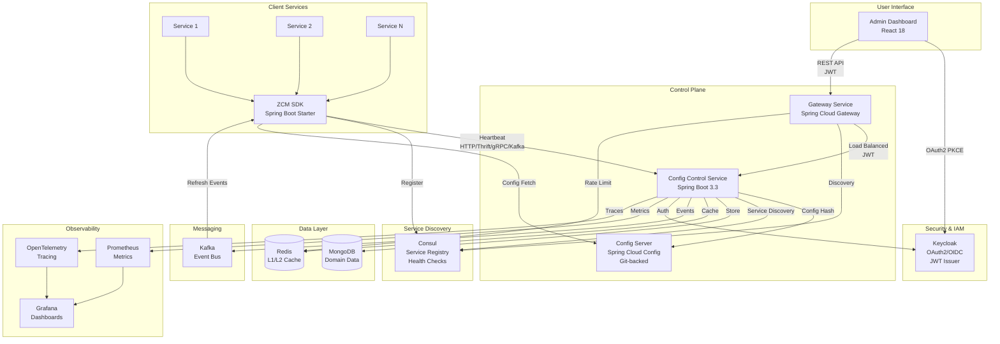
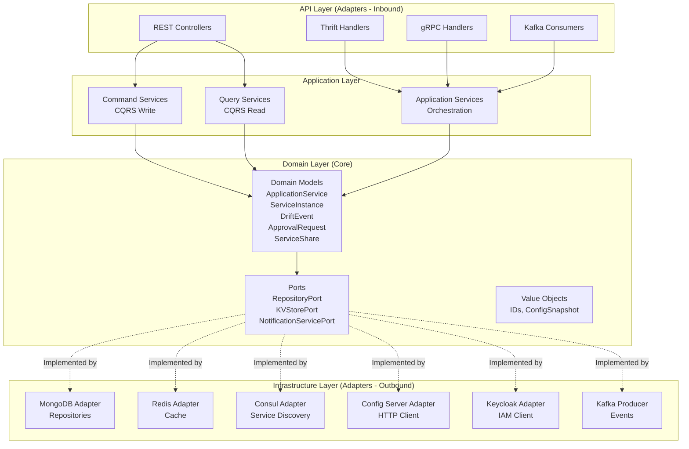
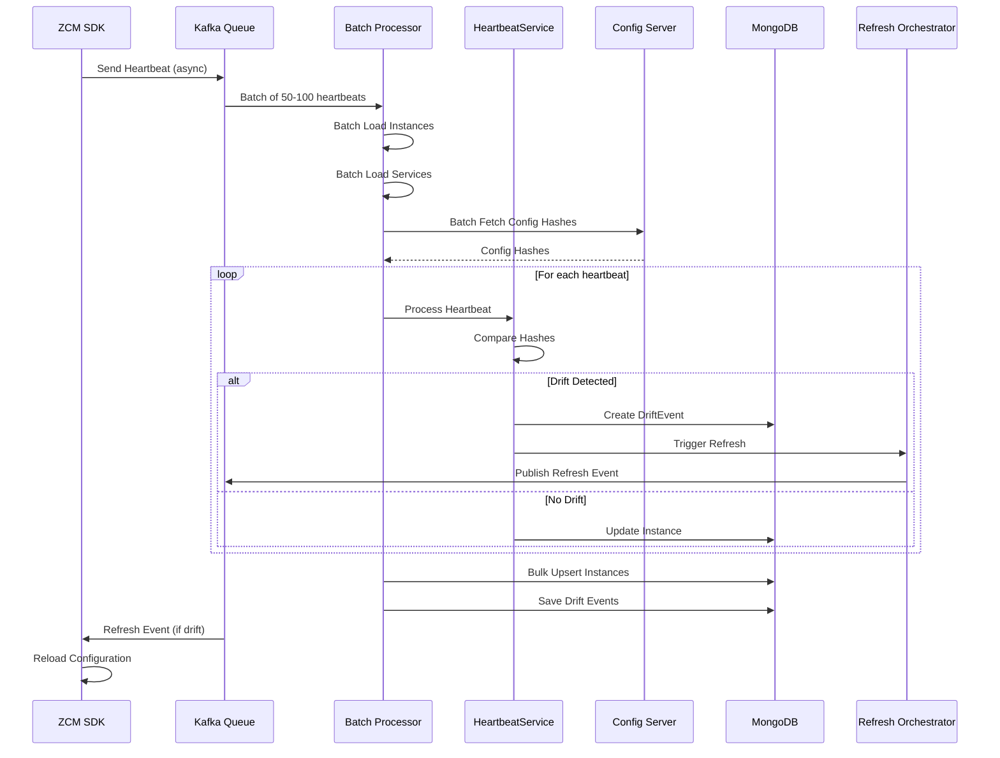
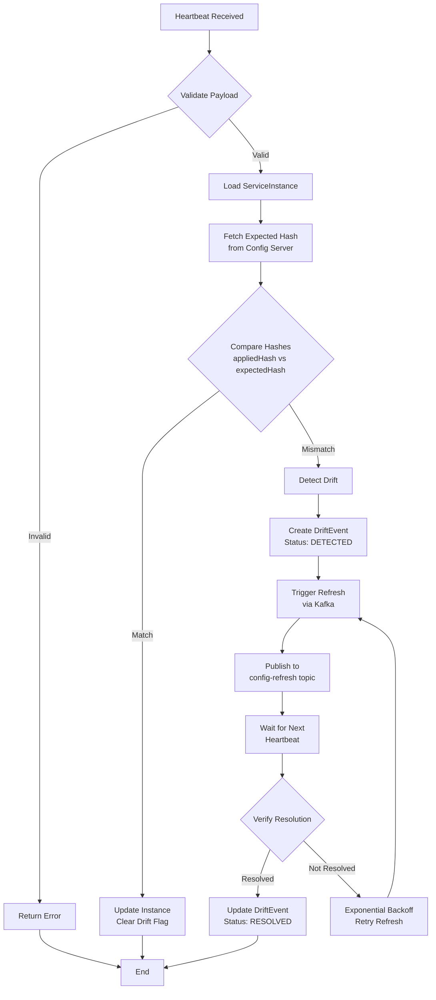
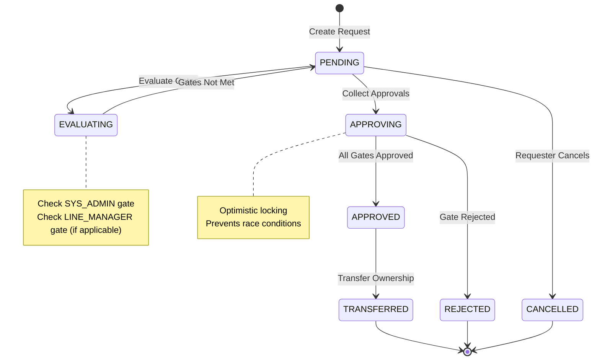
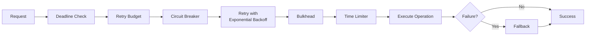
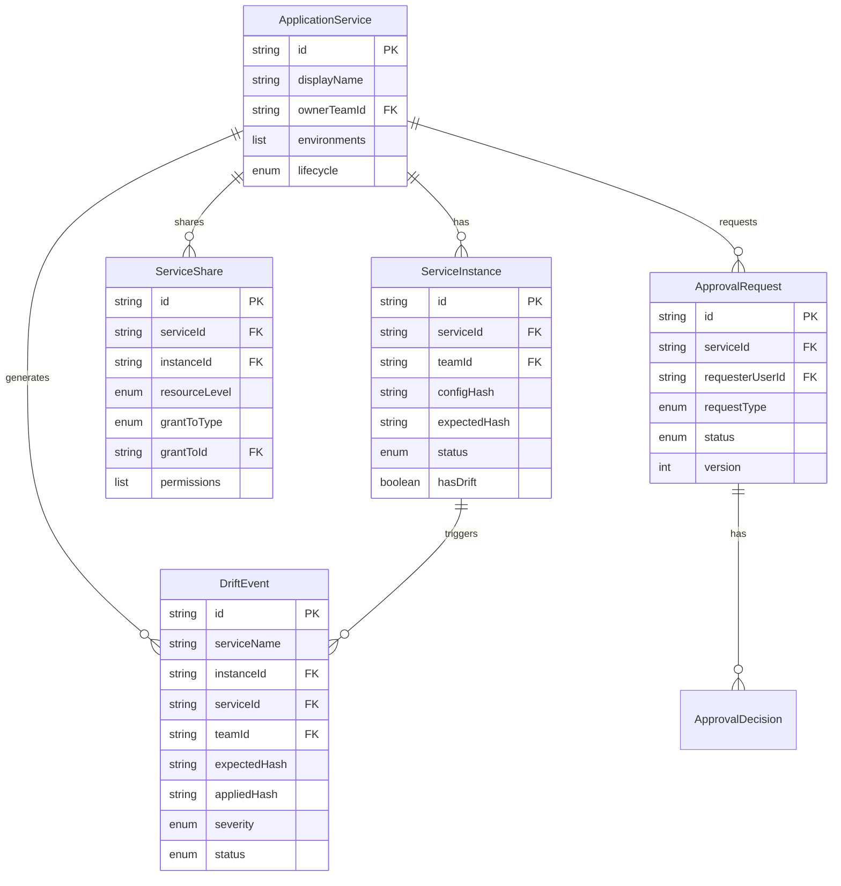
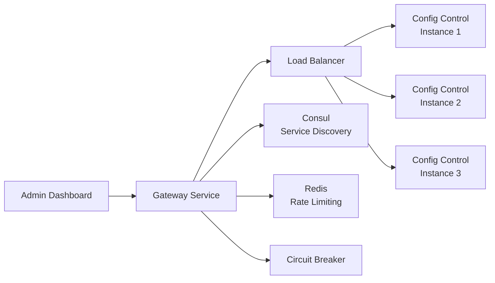

# Technical Architecture
## Centralized Configuration Management System

**Presentation Time:** 10-12 minutes  
**Target Audience:** Tech Lead (detailed), Manager (high-level)

---

## System Architecture Overview

### High-Level Component Diagram



### Component Responsibilities

| Component | Responsibility | Technology |
|-----------|---------------|------------|
| **Gateway Service** | API gateway, routing, rate limiting, circuit breaking | Spring Cloud Gateway, Java 21 |
| **Config Control Service** | Central orchestrator, drift detection, access control | Spring Boot 3.3, Java 21 |
| **Config Server** | Git-backed source of truth for configurations | Spring Cloud Config |
| **ZCM SDK** | Client-side integration, heartbeat, refresh | Spring Boot Starter |
| **Consul** | Service registry, health checks | Consul 1.17 |
| **MongoDB** | Domain data storage (services, instances, drift events) | MongoDB 8.0 |
| **Redis** | Multi-level caching (L1: Caffeine, L2: Redis), rate limiting | Redis Latest |
| **Kafka** | Event bus for configuration refresh | Apache Kafka |
| **Keycloak** | Identity and Access Management | Keycloak 26.4.0 |
| **Admin Dashboard** | Web UI for operations and monitoring | React 18, TypeScript |

---

## Hexagonal Architecture (Ports & Adapters)

### Architecture Layers



### Package Structure

```
com.example.control/
├── api/                          # API Layer (Adapters - Inbound)
│   ├── http/
│   │   ├── controller/          # REST controllers
│   │   ├── dto/                 # Data Transfer Objects
│   │   └── mapper/              # DTO ↔ Domain mappers
│   ├── rpc/
│   │   ├── thrift/              # Thrift handlers
│   │   └── grpc/                # gRPC handlers
│
├── application/                  # Application Layer
│   ├── command/                 # CQRS Command services
│   ├── query/                   # CQRS Query services
│   ├── service/                 # Application services (orchestration)
│   └── event/                   # Event handlers
│
├── domain/                       # Domain Layer (Core)
│   ├── model/                   # Domain entities
│   ├── port/                    # Ports (interfaces)
│   ├── valueobject/             # Value objects
│   └── criteria/                # Query criteria
│
└── infrastructure/               # Infrastructure Layer (Adapters - Outbound)
    ├── adapter/
    │   ├── persistence/         # MongoDB repositories
    │   ├── external/            # External service clients
    │   └── kv/                  # KV store adapters
    ├── config/                   # Configuration classes
    ├── cache/                   # Caching infrastructure
    ├── resilience/              # Resilience4j decorators
    └── observability/           # Metrics, tracing
```

**Reference:** `config-control-service/src/main/java/com/example/control/`

---

## Design Patterns

### 1. Hexagonal Architecture (Ports & Adapters)

**Purpose:** Isolate business logic from infrastructure concerns

**Implementation:**
- **Domain Layer**: Pure business logic, no framework dependencies
- **Ports**: Interfaces defined in domain layer (`domain/port/`)
- **Adapters**: Implementations in infrastructure layer (`infrastructure/adapter/`)

**Example:**
- **Port**: `domain/port/repository/ServiceInstanceRepositoryPort.java`
- **Adapter**: `infrastructure/adapter/persistence/mongo/repository/ServiceInstanceMongoRepository.java`

### 2. CQRS (Command Query Responsibility Segregation)

**Purpose:** Separate read and write operations for performance and scalability

**Implementation:**
- **Command Services**: `application/command/` (write operations)
- **Query Services**: `application/query/` (read operations)
- **Separate Models**: Command DTOs vs Query DTOs

**Benefits:**
- Optimized read queries (aggregations, projections)
- Independent scaling of read/write workloads
- Clear separation of concerns

### 3. Strategy Pattern

**Purpose:** Support multiple protocols for heartbeat and load balancing

**Implementations:**

#### Ping Strategies
- `HttpRestPingStrategy` - HTTP REST protocol
- `ThriftRpcPingStrategy` - Apache Thrift RPC
- `GrpcPingStrategy` - gRPC protocol
- `KafkaPingStrategy` - Kafka messaging

**Reference:** `zcm-spring-sdk-starter/src/main/java/com/vng/zing/zcm/pingconfig/strategy/`

#### Load Balancing Strategies
- Round Robin
- Random
- Weighted Random
- Rendezvous Hashing
- Consistent Hashing

**Reference:** `zcm-spring-sdk-starter/src/main/java/com/vng/zing/zcm/client/loadbalancer/strategy/`

### 4. Circuit Breaker Pattern

**Purpose:** Prevent cascading failures in distributed systems

**Implementation:** Resilience4j with per-service configuration

**Configuration:** `application-resilience.yml:4-59`

**Circuit Breaker States:**
- **CLOSED**: Normal operation
- **OPEN**: Threshold exceeded, fail-fast
- **HALF_OPEN**: Testing recovery

### 5. Batch Processing Pattern

**Purpose:** Optimize throughput for high-volume heartbeat processing

**Implementation:**
- Kafka consumer with batch processing
- Bulk database operations
- Batch config hash fetching

**Reference:** `config-control-service/src/main/java/com/example/control/application/service/infra/HeartbeatBatchService.java:110-175`

**Performance Improvement:** 5x throughput increase vs single processing

#### Async Batch Processing Summary

The system implements asynchronous batch processing for heartbeat ingestion to achieve high throughput and reduce database load.

**Key Improvements:**
- **5x throughput improvement** (placeholder for actual metrics)
- **50-100x database write reduction** (N writes → 1 bulk write per batch)
- **~10x config hash fetch reduction** (deduplication by service:env)
- **Parallel execution** using CompletableFuture for config hash fetching

**Architecture:**
- Kafka consumer with batch listener (50-100 heartbeats per batch)
- Batch loading of ServiceInstances and ApplicationServices
- Parallel config hash fetching grouped by service:environment
- In-memory processing with drift transition tracking
- Bulk MongoDB upserts
- Grouped bus refresh (one per service)

**When to Use:**
- High-volume scenarios (>1000 service instances)
- Need for maximum throughput
- Acceptable slight latency increase for individual heartbeats

**Reference:** See [Async Batch Processing Deep-Dive](./appendices/async-batch-processing.md) for detailed comparison with synchronous processing.

---

## Data Flow Diagrams

### Heartbeat Processing Flow



### Drift Detection & Auto-Remediation Flow



### Approval Workflow State Machine



---

## Resilience Patterns

### Decorator Chain



**Implementation:** `config-control-service/src/main/java/com/example/control/infrastructure/resilience/ResilienceDecoratorsFactory.java`

### Resilience Configuration

| Component | Circuit Breaker | Retry | Bulkhead | Time Limiter |
|-----------|----------------|-------|----------|--------------|
| ConfigServer | 50% failure, 30s wait | 3 attempts, exp backoff | 20 concurrent | 5s |
| Consul | 50% failure, 20s wait | 3 attempts, exp backoff | 25 concurrent | 3s |
| Keycloak | 60% failure, 40s wait | 3 attempts, exp backoff | 15 concurrent | 5s |
| MongoDB | 50% failure, 30s wait | 3 attempts, exp backoff | 20 concurrent | 3s |

**Reference:** `application-resilience.yml`

---

## Domain Model Relationships



**Reference:** `config-control-service/src/main/java/com/example/control/domain/model/`

---

## Gateway Service

### Overview

The Gateway Service provides a single entry point for all API requests from the Admin Dashboard and external clients. It centralizes cross-cutting concerns such as routing, security, rate limiting, and resilience patterns.

### Architecture Role



### Key Features

1. **Service Discovery Integration**
   - Automatic discovery of `config-control-service` instances via Consul
   - Health-aware routing (only healthy instances)
   - Dynamic instance registration/deregistration

2. **Load Balancing**
   - Round-robin load balancing across multiple backend instances
   - Caffeine cache for service instance metadata
   - Client-side load balancing via Spring Cloud LoadBalancer

3. **Circuit Breaker**
   - Resilience4j circuit breaker with configurable thresholds
   - Failure rate: 50% (10 calls minimum, sliding window: 10)
   - Automatic fallback to `/fallback` endpoint
   - Timeout: 5s per request

4. **Rate Limiting**
   - Per-user rate limiting based on JWT `sub` claim
   - Falls back to IP address if JWT not present
   - Redis-based token bucket algorithm
   - Replenish rate: 100 requests/second
   - Burst capacity: 200 requests

5. **CORS Handling**
   - Centralized CORS configuration at gateway level
   - Supports all HTTP methods (GET, POST, PUT, DELETE, PATCH, OPTIONS)
   - Credentials enabled for authenticated requests
   - Configurable allowed origins

6. **JWT Forwarding**
   - Forwards JWT tokens from requests to backend services
   - Backend services validate tokens independently
   - No token modification or validation at gateway

7. **Correlation ID Tracking**
   - Automatic correlation ID generation for each request
   - Adds `X-Correlation-ID` header to requests
   - Propagates correlation ID to backend services
   - Enables distributed tracing and log correlation

### Technical Highlights

**Reactive Architecture:**
- Built on Spring WebFlux (reactive stack)
- Non-blocking I/O for high concurrency
- Efficient resource utilization

**Configuration:**
- Route definitions: `/api/**` → `lb://config-control-service`
- Filters: Circuit breaker, rate limiter, retry, response headers
- HTTP client: 500 max connections, 5s response timeout

**Health Checks:**
- Basic health: `/actuator/health`
- Readiness: `/actuator/health/readiness` (checks backend availability)
- Custom health indicator: `BackendHealthIndicator`

**Observability:**
- Prometheus metrics export
- Gateway route monitoring (`/actuator/gateway/routes`)
- OpenTelemetry tracing (OTLP-ready, currently disabled)
- Structured logging with correlation IDs

### Implementation

**Main Components:**
- `GatewayApplication.java` - Main application class
- `CorsConfig.java` - CORS configuration
- `RateLimitConfig.java` - Rate limiting key resolver
- `CorrelationIdFilter.java` - Global filter for correlation IDs
- `LoggingFilter.java` - Request/response logging
- `FallbackController.java` - Circuit breaker fallback endpoint
- `BackendHealthIndicator.java` - Custom health check

**Configuration Files:**
- `application-gateway.yml` - Route and filter definitions
- `application-resilience.yml` - Circuit breaker configuration
- `application-redis.yml` - Redis connection for rate limiting
- `application-discovery.yml` - Consul service discovery
- `application-observability.yml` - Metrics and tracing

**Reference:** `gateway-service/README.md`, `gateway-service/src/main/resources/application-gateway.yml`

---

## Key Design Decisions

### 1. Batch Processing for Heartbeats

**Decision:** Process heartbeats in batches (50-100) instead of individually

**Rationale:**
- 5x throughput improvement
- Reduced database round-trips
- Better cache utilization

**Trade-offs:**
- Slightly higher latency for individual heartbeats
- More complex error handling

**Reference:** `HeartbeatBatchService.java`

### 2. Multi-Protocol Support

**Decision:** Support HTTP, Thrift, gRPC, and Kafka for heartbeats

**Rationale:**
- Flexibility for different client environments
- Performance optimization (Kafka for high-throughput)
- Protocol-specific optimizations

**Trade-offs:**
- Increased complexity
- More code to maintain

### 3. CQRS Pattern

**Decision:** Separate command and query services

**Rationale:**
- Optimized read queries (aggregations, projections)
- Independent scaling
- Clear separation of concerns

**Trade-offs:**
- Code duplication
- Eventual consistency considerations

### 4. Hexagonal Architecture

**Decision:** Use Ports & Adapters pattern

**Rationale:**
- Testability (easy to mock ports)
- Framework independence
- Clear boundaries

**Trade-offs:**
- More abstraction layers
- Initial setup complexity

---

## Appendices

For detailed information, see:
- [Hexagonal Architecture Details](./appendices/hexagonal-architecture.md)
- [Design Patterns Deep Dive](./appendices/design-patterns.md)
- [Data Flow Diagrams](./appendices/data-flow.md)
- [Async Batch Processing Deep-Dive](./appendices/async-batch-processing.md)
- [Data Models & Database Schema](./appendices/data-models.md)

---

**Next:** Review [Core Features](../03-core-features/README.md) for implementation details.

