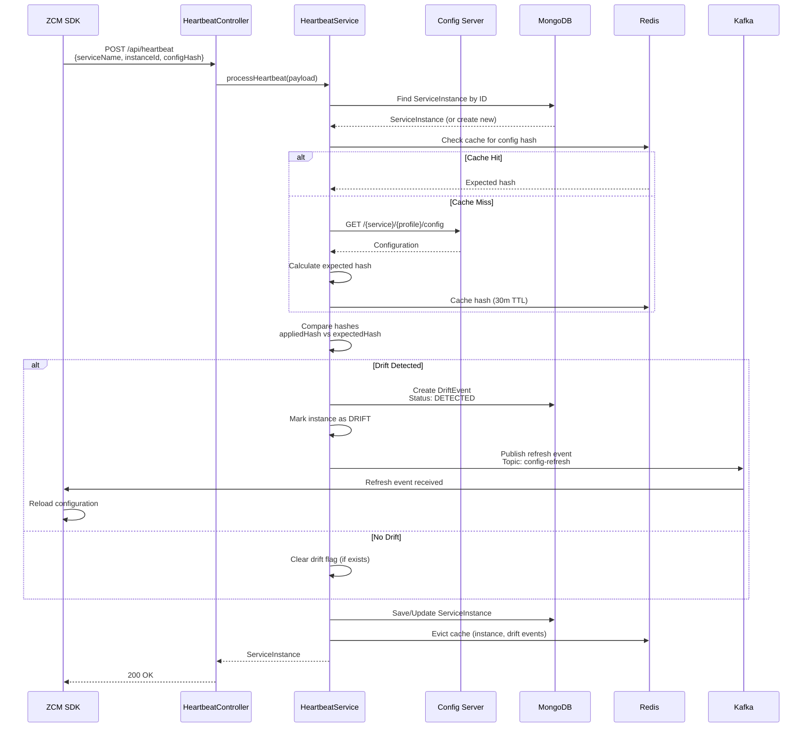
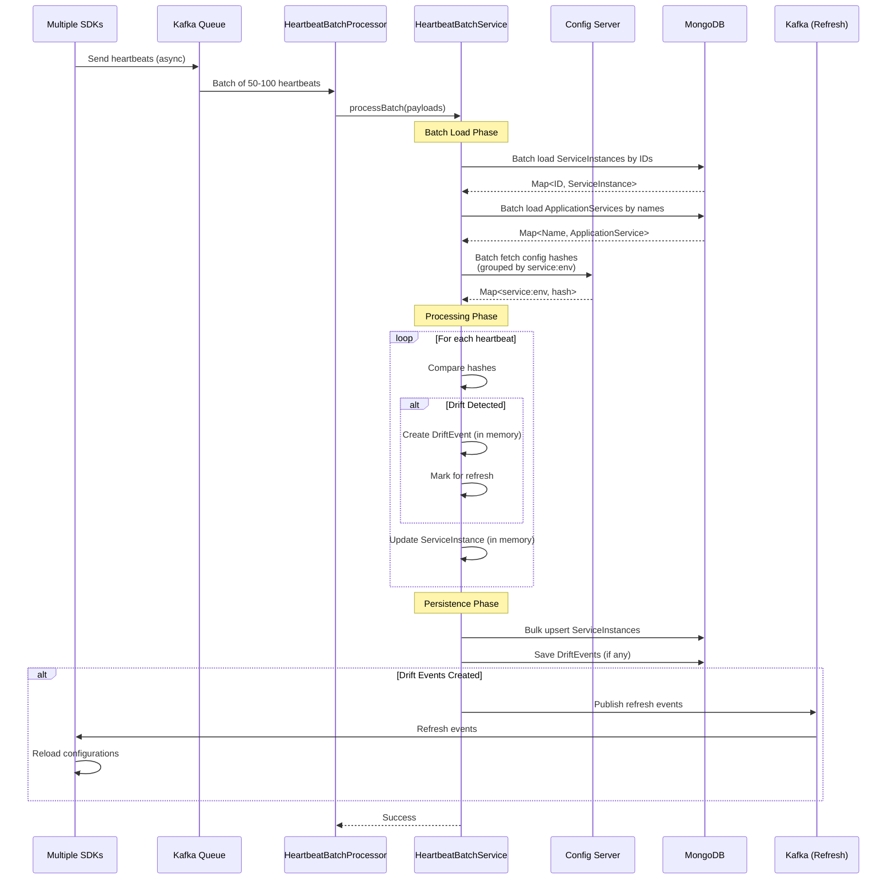
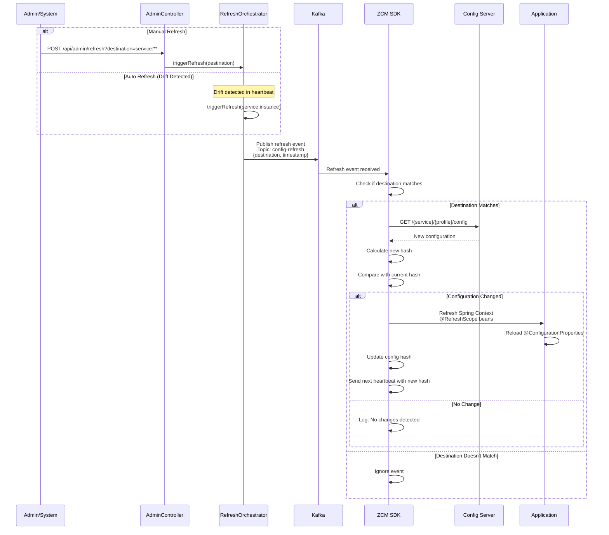
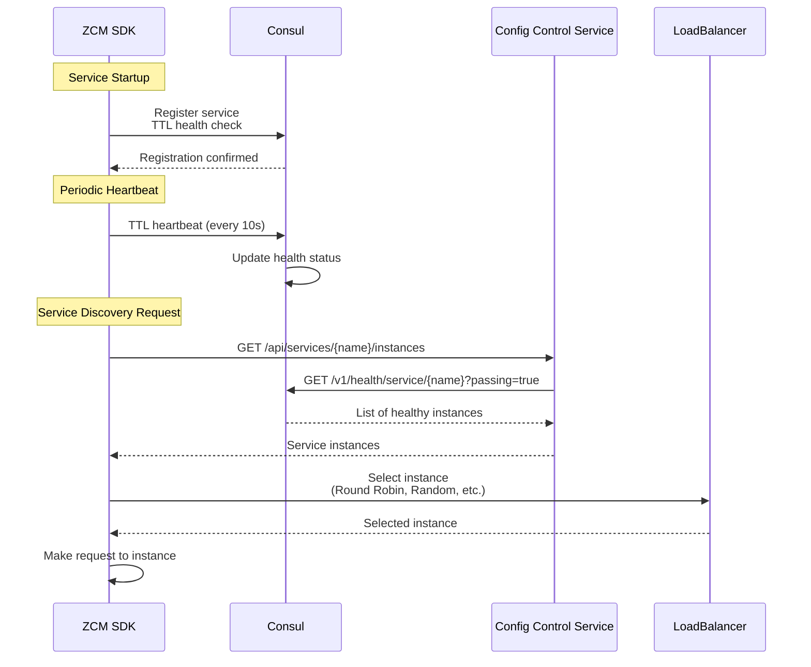
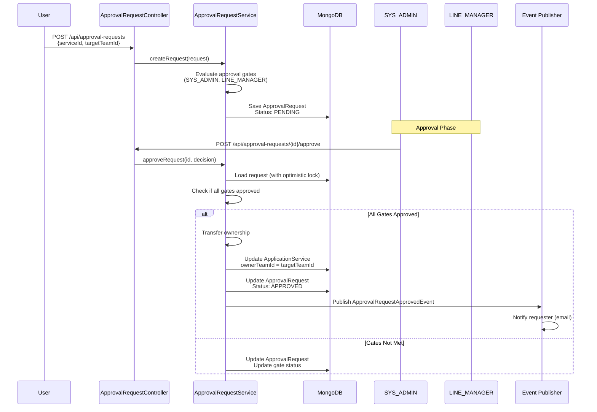
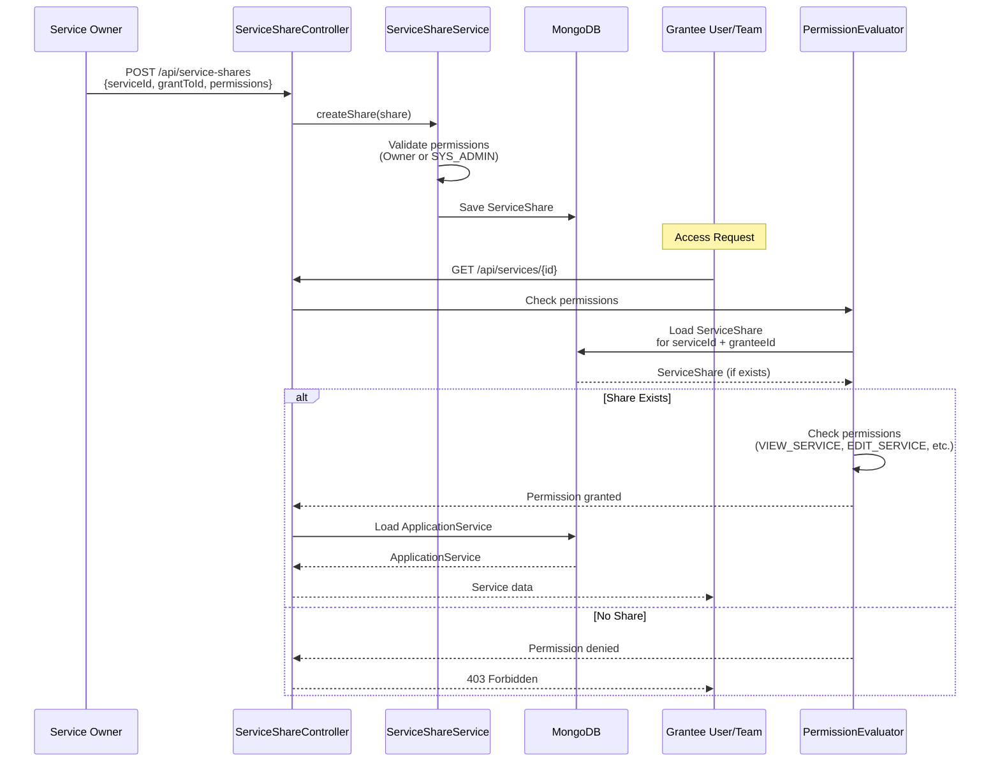
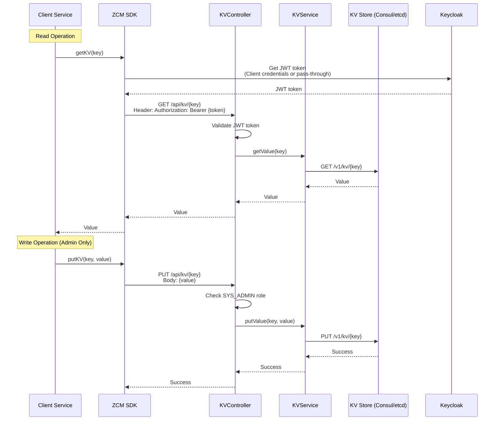
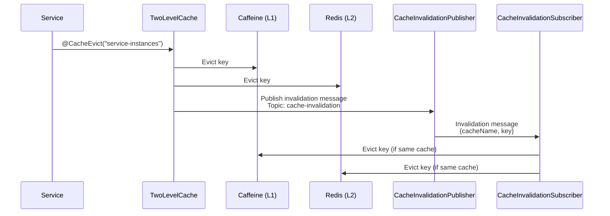

# Data Flow Diagrams
## Request Processing and Event Flows

---

## Heartbeat Processing Flow

### Single Heartbeat Processing

**Reference:** `config-control-service/src/main/java/com/example/control/application/service/infra/HeartbeatService.java:97-138`

---

## Batch Heartbeat Processing

**Reference:** `config-control-service/src/main/java/com/example/control/application/service/infra/HeartbeatBatchService.java:110-175`

**Performance:** 5x throughput improvement vs single processing

---

## Configuration Refresh Flow

**Reference:** `config-control-service/src/main/java/com/example/control/application/service/infra/ConfigRefreshOrchestrator.java`

---

## Service Discovery Flow

**Reference:** `config-control-service/src/main/java/com/example/control/api/http/controller/infra/ServiceRegistryController.java`

---

## Approval Workflow Flow

**Reference:** `config-control-service/src/main/java/com/example/control/application/service/ApprovalRequestService.java`

---

## Service Sharing Flow

**Reference:** `config-control-service/src/main/java/com/example/control/application/service/ServiceShareService.java`

---

## Key-Value Store Flow

**Reference:** `config-control-service/src/main/java/com/example/control/api/http/controller/kv/KVController.java`

---

## Cache Invalidation Flow

**Reference:** `config-control-service/src/main/java/com/example/control/infrastructure/cache/CacheInvalidationPublisher.java`

---

## References

- [Heartbeat Processing](../README.md#heartbeat-processing-flow)
- [Batch Processing](../README.md#batch-processing-pattern)
- [Approval Workflow](../README.md#approval-workflow-state-machine)

