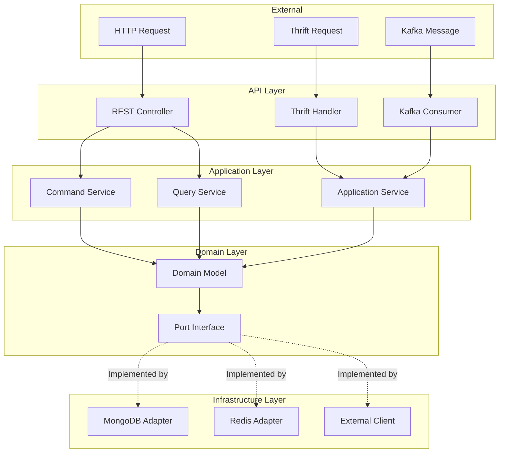

# Hexagonal Architecture Details
## Ports & Adapters Pattern Implementation

---

## Architecture Overview

The Config Control Service follows the **Hexagonal Architecture** (also known as Ports & Adapters) pattern, which isolates business logic from infrastructure concerns.

### Core Principles

1. **Domain Independence**: Business logic has no dependencies on frameworks or infrastructure
2. **Ports Define Contracts**: Interfaces in the domain layer define what the application needs
3. **Adapters Implement**: Infrastructure layer provides concrete implementations
4. **Dependency Inversion**: Domain depends on abstractions, not implementations

---

## Layer Structure

### 1. Domain Layer (Core)

**Location:** `com.example.control.domain/`

**Responsibilities:**
- Business logic and rules
- Domain entities and value objects
- Port interfaces (contracts)
- Domain events

**Key Components:**

#### Domain Models
- `ApplicationService` - Service metadata and ownership
- `ServiceInstance` - Runtime instance with config state
- `DriftEvent` - Configuration drift detection events
- `ApprovalRequest` - Multi-gate approval workflow
- `ServiceShare` - Access control sharing
- `ApprovalDecision` - Individual approval decisions

**Reference:** `config-control-service/src/main/java/com/example/control/domain/model/`

#### Ports (Interfaces)
- `RepositoryPort<T>` - Generic repository interface
- `KVStorePort` - Key-Value store operations
- `NotificationServicePort` - Notification service interface

**Reference:** `config-control-service/src/main/java/com/example/control/domain/port/`

#### Value Objects
- `ServiceInstanceId` - Composite ID (serviceName:instanceId)
- `ApplicationServiceId` - Service identifier
- `DriftEventId` - Drift event identifier
- `ConfigSnapshot` - Canonical configuration representation

**Reference:** `config-control-service/src/main/java/com/example/control/domain/valueobject/`

### 2. Application Layer

**Location:** `com.example.control.application/`

**Responsibilities:**
- Use case orchestration
- Command/Query separation (CQRS)
- Application services
- Event handling

**Key Components:**

#### Command Services (Write Operations)
- `ApplicationServiceCommandService` - Create, update, delete services
- `ServiceInstanceCommandService` - Update instance state
- `DriftEventCommandService` - Create and resolve drift events
- `ApprovalRequestCommandService` - Create and manage approval requests
- `ServiceShareCommandService` - Grant and revoke shares

**Reference:** `config-control-service/src/main/java/com/example/control/application/command/`

#### Query Services (Read Operations)
- `ApplicationServiceQueryService` - Query services with filters
- `ServiceInstanceQueryService` - Query instances
- `DriftEventQueryService` - Query drift events
- `ApprovalRequestQueryService` - Query approval requests

**Reference:** `config-control-service/src/main/java/com/example/control/application/query/`

#### Application Services (Orchestration)
- `HeartbeatService` - Process individual heartbeats
- `HeartbeatBatchService` - Batch process heartbeats
- `ConfigProxyService` - Proxy config server operations
- `ApprovalService` - Orchestrate approval workflows

**Reference:** `config-control-service/src/main/java/com/example/control/application/service/`

### 3. API Layer (Adapters - Inbound)

**Location:** `com.example.control.api/`

**Responsibilities:**
- Handle external requests
- Protocol translation (HTTP, Thrift, gRPC, Kafka)
- DTO mapping
- Input validation

**Key Components:**

#### REST Controllers
- `HeartbeatController` - HTTP heartbeat endpoint
- `ApplicationServiceController` - Service CRUD operations
- `ServiceInstanceController` - Instance queries
- `DriftEventController` - Drift event management
- `ApprovalRequestController` - Approval workflow
- `ServiceShareController` - Sharing management

**Reference:** `config-control-service/src/main/java/com/example/control/api/http/controller/`

#### RPC Handlers
- `ThriftHeartbeatHandler` - Thrift RPC handler
- `GrpcHeartbeatHandler` - gRPC handler (prepared)

**Reference:** `config-control-service/src/main/java/com/example/control/api/rpc/`

#### Kafka Consumers
- `HeartbeatKafkaConsumer` - Async heartbeat ingestion
- `RefreshEventListener` - Configuration refresh events

**Reference:** `config-control-service/src/main/java/com/example/control/infrastructure/config/messaging/`

### 4. Infrastructure Layer (Adapters - Outbound)

**Location:** `com.example.control.infrastructure/`

**Responsibilities:**
- Implement port interfaces
- External service clients
- Database adapters
- Caching infrastructure
- Resilience patterns

**Key Components:**

#### Persistence Adapters
- `ServiceInstanceMongoRepository` - MongoDB repository
- `ApplicationServiceMongoRepository` - MongoDB repository
- `DriftEventMongoRepository` - MongoDB repository

**Reference:** `config-control-service/src/main/java/com/example/control/infrastructure/adapter/persistence/mongo/repository/`

#### External Service Clients
- `ConfigServerClient` - HTTP client for Config Server
- `ConsulClient` - Consul API client
- `KeycloakClient` - Keycloak IAM client

**Reference:** `config-control-service/src/main/java/com/example/control/infrastructure/adapter/external/`

#### Cache Adapters
- `TwoLevelCacheManager` - L1 (Caffeine) + L2 (Redis)
- `ResilientRedisCache` - Redis cache with resilience

**Reference:** `config-control-service/src/main/java/com/example/control/infrastructure/cache/`

---

## Dependency Flow



**Key Rule:** Dependencies flow inward. Outer layers depend on inner layers, but inner layers never depend on outer layers.

---

## Port Implementation Example

### Port Definition (Domain Layer)

```java
// domain/port/repository/ServiceInstanceRepositoryPort.java
public interface ServiceInstanceRepositoryPort {
    Optional<ServiceInstance> findById(ServiceInstanceId id);
    ServiceInstance save(ServiceInstance instance);
    List<ServiceInstance> saveAll(List<ServiceInstance> instances);
    // ... other methods
}
```

### Adapter Implementation (Infrastructure Layer)

```java
// infrastructure/adapter/persistence/mongo/repository/ServiceInstanceMongoRepository.java
@Repository
public interface ServiceInstanceMongoRepository 
    extends MongoRepository<ServiceInstanceDocument, String>,
            ServiceInstanceRepositoryPort {
    // MongoDB-specific queries
}
```

### Usage in Application Layer

```java
// application/service/ServiceInstanceService.java
@Service
public class ServiceInstanceService {
    private final ServiceInstanceRepositoryPort repository; // Depends on port, not implementation
    
    public ServiceInstance findById(ServiceInstanceId id) {
        return repository.findById(id).orElseThrow();
    }
}
```

---

## Benefits of Hexagonal Architecture

### 1. Testability

- **Easy Mocking**: Ports can be easily mocked in tests
- **Unit Testing**: Domain logic can be tested without infrastructure
- **Integration Testing**: Adapters can be swapped for test doubles

### 2. Framework Independence

- **Domain Logic**: No Spring annotations in domain layer
- **Technology Flexibility**: Can swap MongoDB for PostgreSQL, Redis for Hazelcast
- **Framework Evolution**: Can upgrade Spring Boot without changing domain logic

### 3. Clear Boundaries

- **Separation of Concerns**: Each layer has clear responsibilities
- **Dependency Management**: Dependencies flow in one direction
- **Code Organization**: Easy to navigate and understand

### 4. Maintainability

- **Isolated Changes**: Changes in infrastructure don't affect domain
- **Parallel Development**: Teams can work on different layers
- **Refactoring Safety**: Domain logic can be refactored independently

---

## Testing Strategy

### Unit Tests

- **Domain Layer**: Pure Java, no framework dependencies
- **Application Layer**: Mock ports, test business logic
- **API Layer**: Mock application services, test DTO mapping

### Integration Tests

- **Infrastructure Adapters**: Test against real databases/external services
- **End-to-End**: Test full request flow with Testcontainers

**Reference:** `config-control-service/src/test/`

---

## Migration Path

If you need to change infrastructure:

1. **Define New Port** (if needed) in domain layer
2. **Implement New Adapter** in infrastructure layer
3. **Update Configuration** to use new adapter
4. **No Changes** to domain or application layers

**Example:** Switching from MongoDB to PostgreSQL
- Create `PostgresAdapter` implementing `RepositoryPort`
- Update Spring configuration
- Domain and application layers remain unchanged

---

## References

- [Domain Models](../README.md#domain-model-relationships)
- [Application Services](../README.md#application-layer)
- [Infrastructure Adapters](../README.md#infrastructure-layer)
- [Spring Boot Documentation](https://spring.io/projects/spring-boot)

