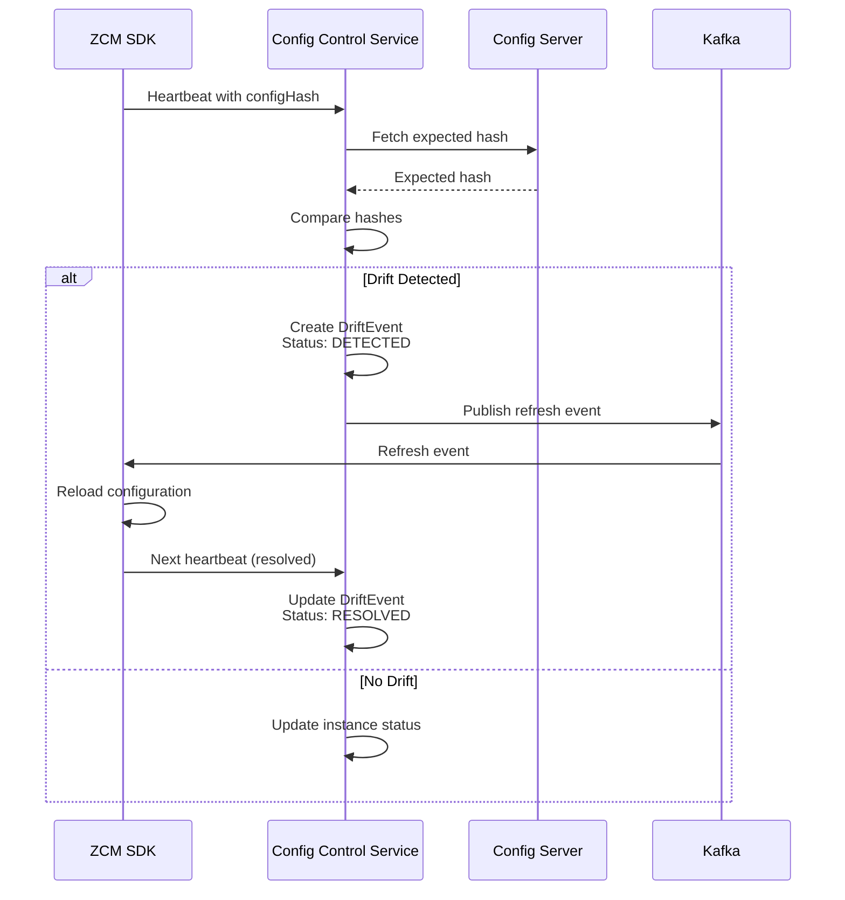
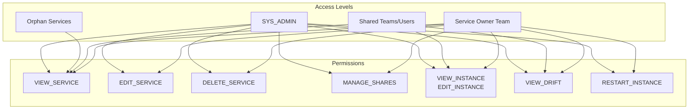
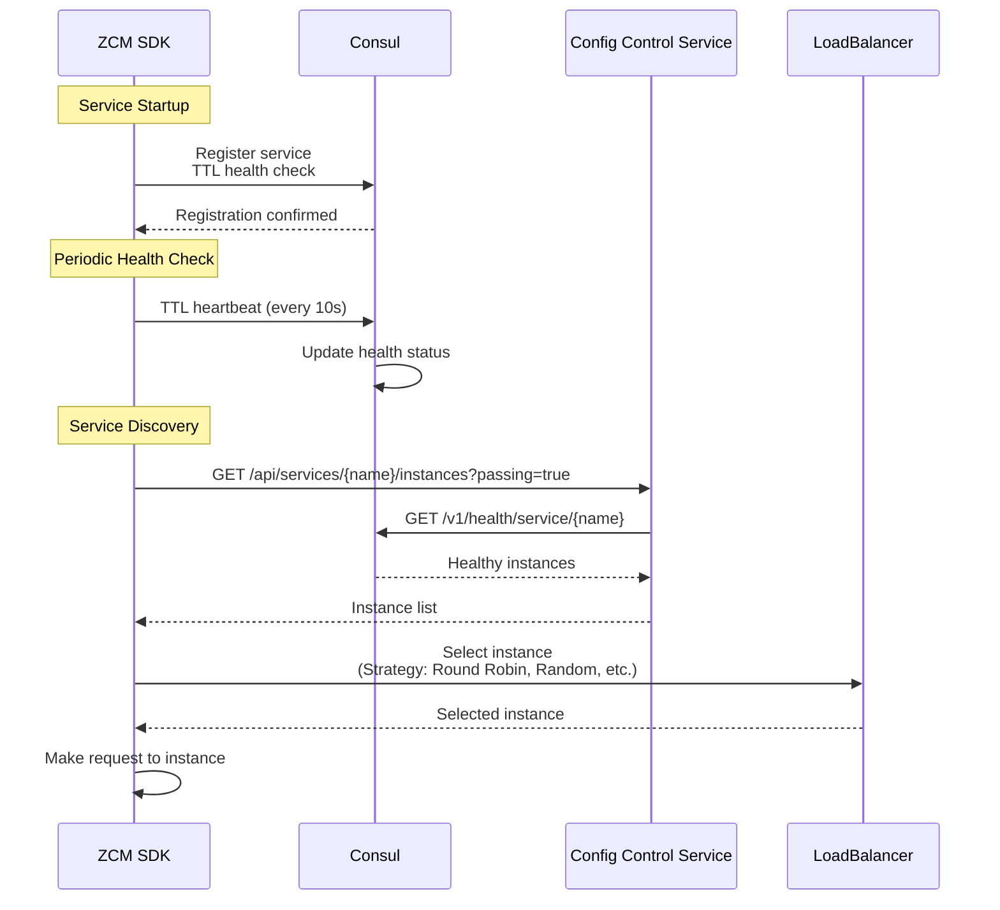
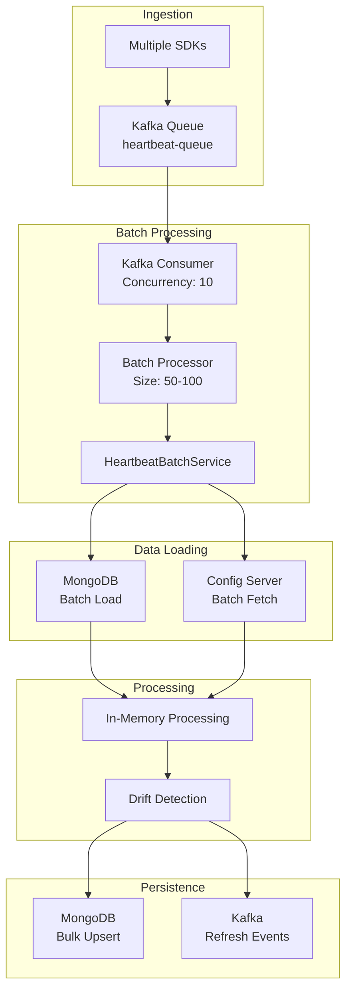
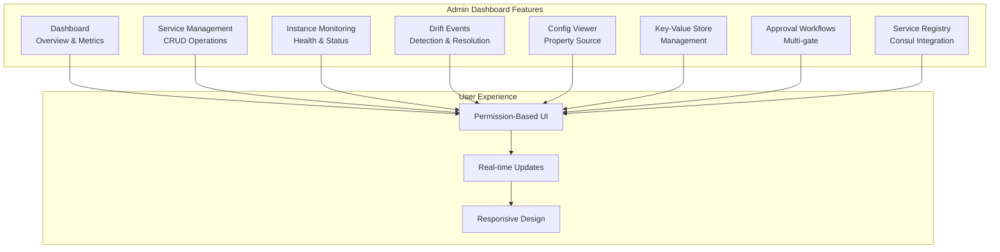
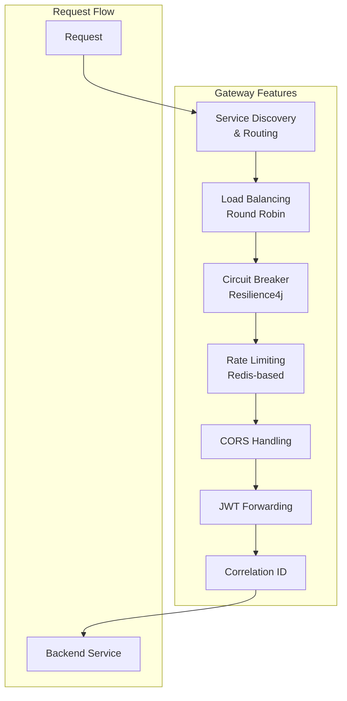
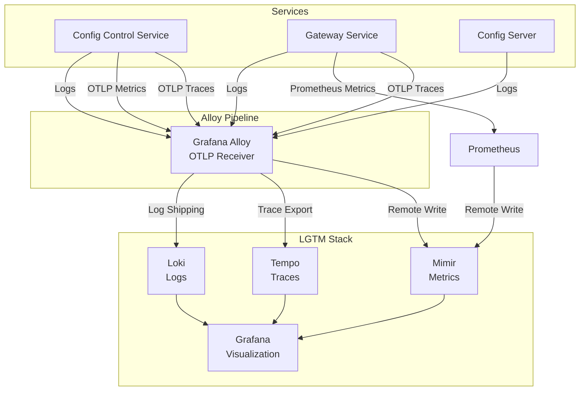

# Core Features
## Centralized Configuration Management System

**Presentation Time:** 8-10 minutes  
**Target Audience:** Tech Lead, Manager

---

## Feature Overview

The system provides comprehensive configuration management capabilities with automated drift detection, team-based access control, service discovery, and high-performance batch processing.

---

## 1. Configuration Drift Detection

### Business Value
- **Real-time detection** of configuration mismatches (< 1 minute)
- **Automatic remediation** via event-driven refresh
- **90% reduction** in configuration-related incidents

### How It Works



### Key Features

- **Hash-based comparison**: SHA-256 hash of canonical configuration
- **Automatic remediation**: Triggers refresh via Kafka events
- **Drift event tracking**: Full audit trail with severity levels
- **Multi-environment support**: Environment-specific drift detection

### Implementation

**Core Service:** `config-control-service/src/main/java/com/example/control/application/service/infra/HeartbeatService.java:97-138`

**Drift Event Model:** `config-control-service/src/main/java/com/example/control/domain/model/DriftEvent.java`

**Metrics:**
- `heartbeat.drift.detected` - Drift detection count
- `drift.event.count{status, severity}` - Drift event statistics

---

## 2. Team-Based Access Control

### Business Value
- **Fine-grained permissions** for service management
- **Compliance-ready** with approval workflows
- **Team isolation** with sharing capabilities

### Access Control Model



### Key Features

- **Team ownership**: Services belong to teams (Keycloak groups)
- **Orphan services**: Unclaimed services visible to all authenticated users
- **Service sharing**: Fine-grained sharing with environment filters
- **Approval workflows**: Multi-gate approval for ownership transfers

### Implementation

**Permission Evaluator:** `config-control-service/src/main/java/com/example/control/infrastructure/config/security/DomainPermissionEvaluator.java`

**Service Share Model:** `config-control-service/src/main/java/com/example/control/domain/model/ServiceShare.java`

**Approval Request:** `config-control-service/src/main/java/com/example/control/domain/model/ApprovalRequest.java`

---

## 3. Service Discovery & Load Balancing

### Business Value
- **Automatic service registration** with Consul
- **Client-side load balancing** for high performance
- **Health-aware routing** based on Consul health checks

### Service Discovery Flow



### Load Balancing Strategies

1. **Round Robin** - Sequential instance selection
2. **Random** - Random instance selection
3. **Weighted Random** - Weighted random selection
4. **Rendezvous Hashing** - Consistent hashing by key
5. **Consistent Hashing** - Ring-based consistent hashing

**Configuration:** `zcm.sdk.loadbalancer.strategy` property

**Reference:** `zcm-spring-sdk-starter/src/main/java/com/vng/zing/zcm/client/loadbalancer/strategy/`

---

## 4. Batch Heartbeat Processing

### Business Value
- **5x throughput improvement** vs single processing
- **Reduced database load** with bulk operations
- **Better cache utilization** with batch fetching

### Batch Processing Architecture



### Performance Metrics

| Metric | Single Processing | Batch Processing | Improvement |
|--------|------------------|------------------|-------------|
| Throughput | 2,000 heartbeats/min | 10,000+ heartbeats/min | **5x** |
| Database Calls | 1 per heartbeat | 1 per batch | **50-100x reduction** |
| Config Server Calls | 1 per heartbeat | 1 per service:env | **~10x reduction** |

**Implementation:** `config-control-service/src/main/java/com/example/control/application/service/infra/HeartbeatBatchService.java:110-175`

**Configuration:** `application-app.yml:126-143`

---

## 5. Key-Value Store Integration

### Business Value
- **Centralized key-value storage** for application data
- **Multi-backend support** (Consul, etcd)
- **Secure access** with JWT authentication

### KV Store Architecture

```mermaid
graph TB
    subgraph "Client"
        SDK[ZCM SDK]
    end
    
    subgraph "API Layer"
        API[KVController]
        AUTH[Auth Validator]
    end
    
    subgraph "Service Layer"
        SVC[KVService]
        PORT[KVStorePort]
    end
    
    subgraph "Storage Backends"
        CONSUL_KV[Consul KV]
        ETCD_KV[etcd KV]
    end
    
    subgraph "Security"
        KC[Keycloak<br/>JWT Issuer]
    end
    
    SDK -->|JWT Token| KC
    SDK -->|GET/PUT /api/kv/{key}| API
    API --> AUTH
    AUTH -->|Validate JWT| KC
    AUTH --> SVC
    SVC --> PORT
    PORT --> CONSUL_KV
    PORT --> ETCD_KV
```

### Features

- **Read operations**: All authenticated users
- **Write operations**: SYS_ADMIN only
- **Prefix-based policies**: Namespace isolation
- **Caching**: Redis cache with TTL

**Implementation:** `config-control-service/src/main/java/com/example/control/api/http/controller/kv/KVController.java`

**KV Store Port:** `config-control-service/src/main/java/com/example/control/domain/port/KVStorePort.java`

---

## 6. Multi-Protocol Support

### Business Value
- **Protocol flexibility** for different client environments
- **Performance optimization** (Kafka for high-throughput)
- **Backward compatibility** with existing systems

### Supported Protocols

| Protocol | Use Case | Performance |
|----------|----------|-------------|
| **HTTP REST** | Standard web services | Medium |
| **Apache Thrift** | High-performance RPC | High |
| **gRPC** | Modern microservices | High |
| **Kafka** | High-throughput async | Very High |

### Protocol Selection

**SDK Configuration:**
```yaml
zcm:
  sdk:
    ping:
      protocol: HTTP  # or THRIFT, GRPC, KAFKA
```

**Implementation:** `zcm-spring-sdk-starter/src/main/java/com/vng/zing/zcm/pingconfig/strategy/`

---

## 7. Admin Dashboard

### Business Value
- **Self-service operations** for service management
- **Real-time visibility** into system health and drift events
- **Permission-based UI** ensuring secure access
- **Reduced operational overhead** through automation

### Features Overview



### Key Capabilities

1. **Service Catalog Management**
   - View all services (owned, shared, orphaned)
   - Create, edit, delete services
   - Claim ownership for orphaned services
   - Manage service environments

2. **Instance Monitoring**
   - Real-time instance health status
   - Drift indicators and resolution
   - Instance metadata and configuration
   - Historical status tracking

3. **Drift Event Management**
   - Filter by severity, status, service
   - Bulk resolution actions
   - Drift event timeline
   - Auto-resolution tracking

4. **Configuration Viewer**
   - Property source navigation
   - YAML/JSON syntax highlighting
   - Search and filter properties
   - Configuration comparison

5. **Key-Value Store**
   - Tree and flat list views
   - JSON editor with validation
   - Bulk operations
   - Prefix-based navigation

6. **Approval Workflows**
   - Multi-gate approval visualization
   - Decision timeline
   - Approver information
   - Request status tracking

7. **Service Registry Integration**
   - Consul service discovery
   - Health check visualization
   - Instance details
   - Service tags and metadata

### Technology Stack

- **React 18** with TypeScript
- **Vite** for build tooling
- **Material-UI (MUI)** for components
- **React Query** for server state
- **Redux Toolkit** for UI state
- **Orval** for API code generation
- **Keycloak** for authentication (PKCE flow)

### Permission System

The dashboard implements a declarative permission system:

- **`<CanAccess>` Component**: Wraps UI elements with permission checks
- **Route-based**: Control access to entire pages
- **Role-based**: SYS_ADMIN, USER roles
- **Service-based**: Team ownership checks
- **Action-based**: VIEW, EDIT, DELETE, MANAGE_SHARES

**Reference:** `admin-dashboard/src/components/auth/CanAccess.tsx`

### Implementation

**Main Features:**
- `admin-dashboard/src/features/application-services/` - Service management
- `admin-dashboard/src/features/drift-events/` - Drift monitoring
- `admin-dashboard/src/features/configs/` - Config viewer
- `admin-dashboard/src/features/key-value-store/` - KV management
- `admin-dashboard/src/features/approvals/` - Approval workflows
- `admin-dashboard/src/features/service-registry/` - Consul integration

**State Management:**
- Redux Toolkit: UI state (sidebar, theme)
- React Query: Server state (API data, caching)
- Context API: Authentication (Keycloak)

**Error Handling:**
- Centralized error transformation
- RFC-7807 problem details support
- Toast notifications (Sonner)
- Global error boundary

**Reference:** `admin-dashboard/IMPLEMENTATION_SUMMARY.md`

---

## 9. Gateway Service

### Business Value

- **Single Entry Point**: Centralized routing for all API requests
- **Centralized Security**: Rate limiting and circuit breaking at gateway level
- **High Availability**: Load balancing across multiple backend instances
- **Operational Efficiency**: Reduced complexity in backend services

### Features Overview



### Key Capabilities

1. **Service Discovery Integration**
   - Automatic discovery of `config-control-service` instances via Consul
   - Health-aware instance selection
   - Dynamic routing based on service registry

2. **Load Balancing**
   - Round-robin distribution across healthy instances
   - Caffeine cache for service instance metadata
   - Automatic failover to healthy instances

3. **Resilience Patterns**
   - Circuit breaker: 50% failure rate threshold
   - Automatic fallback to `/fallback` endpoint
   - Retry with exponential backoff (3 attempts for GET requests)
   - Request timeout: 5s

4. **Rate Limiting**
   - Per-user rate limiting (JWT `sub` claim)
   - IP-based fallback for unauthenticated requests
   - Token bucket algorithm (100 req/s, 200 burst)
   - Redis-backed for distributed rate limiting

5. **CORS Handling**
   - Centralized CORS configuration
   - Supports all HTTP methods
   - Credentials enabled for authenticated requests
   - Configurable allowed origins

6. **JWT Forwarding**
   - Transparent JWT token forwarding to backend
   - Backend services handle token validation
   - No token modification at gateway

7. **Correlation ID Tracking**
   - Automatic correlation ID generation
   - Header propagation: `X-Correlation-ID`
   - Enables distributed tracing and log correlation

8. **Health Checks**
   - Basic health: `/actuator/health`
   - Readiness: Checks backend service availability
   - Custom health indicator for backend dependency

### Configuration

**Routes:**
- `/api/**` → `lb://config-control-service`

**Filters Applied:**
- Circuit breaker (with fallback)
- Rate limiter (per-user)
- Retry (for idempotent requests)
- Response headers (`X-Gateway-Version`)

**Reference:** `gateway-service/src/main/java/com/example/gateway/`, `gateway-service/src/main/resources/application-gateway.yml`

---

## 8. Observability Features

### Overview

The system provides comprehensive observability through the LGTM stack (Loki, Grafana, Tempo, Mimir) with Grafana Alloy as the observability data pipeline. All services export metrics, traces, and logs in standardized formats.

### Observability Stack



### Metrics

**Custom Business Metrics:**
- `heartbeat.processing.time` - Heartbeat processing latency (p50, p95, p99)
- `heartbeat.batch.processing.time` - Batch processing latency
- `heartbeat.drift.detected` - Drift detection count
- `drift.event.count{status, severity}` - Drift event statistics
- `api.heartbeat.process` - API endpoint latency
- `retry.budget.utilization{service}` - Retry budget usage

**Infrastructure Metrics:**
- Circuit breaker states (CLOSED, OPEN, HALF_OPEN)
- Retry counts and success rates
- Bulkhead utilization
- Rate limiter rejections
- Gateway route metrics

**Gateway Metrics:**
- Request count and latency
- Circuit breaker states
- Rate limiter rejections
- Route-specific metrics

**Export:**
- Prometheus format: `/actuator/prometheus`
- OTLP export: Alloy OTLP receiver (for metrics and traces)
- Remote write: Prometheus → Mimir

**Reference:** `config-control-service/src/main/java/com/example/control/infrastructure/observability/heartbeat/HeartbeatMetrics.java`, `application-observability.yml`

### Tracing

**OpenTelemetry Integration:**
- OTLP export to Grafana Alloy
- W3C trace context propagation
- Automatic span creation via `@Observed` annotations
- Distributed tracing across services (Gateway → Config Control Service)
- Trace-to-log correlation via correlation IDs

**Configuration:**
- Sampling: 100% for dev/testing (configurable for production)
- OTLP endpoint: Alloy receiver
- Span exporting: Configurable via predicates

**Gateway Tracing:**
- OpenTelemetry integration (OTLP-ready, currently disabled)
- Correlation ID propagation
- Request/response span creation

**Reference:** `application-observability.yml:2-7`, `config/alloy/alloy-config.alloy`

### Logging

**Structured JSON Logging:**
- Log4j2 with JSON layout
- Single-line logs for parsing
- Consistent keys across services

**MDC Enrichment:**
- Trace ID and span ID
- User context (userId, username)
- Correlation ID (from gateway)
- Request metadata

**Log Levels:**
- Configurable per package
- INFO for state changes
- WARN for recoverable conditions
- ERROR for actionable failures
- DEBUG for development (disabled in production)

**Log Pipeline:**
- Services → Docker logs
- Alloy collects from Docker
- Alloy ships to Loki
- Grafana queries from Loki

**Reference:** `log4j2-spring.xml`, `test/flows/README.md`

### Gateway Observability

**Metrics:**
- Prometheus export: `/actuator/prometheus`
- Gateway route metrics: `/actuator/gateway/routes`
- Circuit breaker metrics
- Rate limiter metrics

**Health Checks:**
- Basic health: `/actuator/health`
- Readiness: `/actuator/health/readiness` (checks backend)
- Custom health indicator: `BackendHealthIndicator`

**Logging:**
- Structured JSON logs
- Correlation ID in MDC
- Request/response logging via `LoggingFilter`

**Reference:** `gateway-service/src/main/resources/application-observability.yml`

### Monitoring & Alerting Runbook

**Overview:** The system implements comprehensive monitoring and alerting using Prometheus, Grafana, and Alertmanager (optional). All services export metrics in Prometheus format, and alerts are configured based on SLOs and business requirements.

**Prometheus Configuration:**
- Scrape interval: 15s
- Evaluation interval: 15s
- Remote write to Mimir: Enabled
- Scrape targets: All application services, infrastructure services, LGTM stack

**Reference:** `config/prometheus/prometheus.yml`

#### Critical Metrics to Monitor

**1. Heartbeat Processing Metrics:**
- `heartbeat.processing.time` - Processing latency (p50, p95, p99)
- `heartbeat.batch.processing.time` - Batch processing latency
- `heartbeat.drift.detected` - Drift detection count
- **Alert Threshold**: p95 latency > 200ms for 2 minutes

**2. API Performance Metrics:**
- `http_server_requests_seconds` - API request latency (p50, p95, p99)
- `http_server_requests_active` - Active request count
- `http_server_errors_total` - Error count
- **Alert Threshold**: 
  - Error rate > 5% for 2 minutes
  - p95 latency > 1s for 2 minutes

**3. Drift Event Metrics:**
- `drift.event.count{status, severity}` - Drift event statistics
- `drift.event.detection.rate` - Drift detection rate
- **Alert Threshold**: 
  - High/Critical drift events > 10 in 5 minutes
  - Unresolved drift events > 50 for 1 hour

**4. Circuit Breaker Metrics:**
- `resilience4j_circuitbreaker_state{state="OPEN"}` - Circuit breaker state
- `resilience4j_circuitbreaker_failure_rate` - Failure rate
- **Alert Threshold**: Circuit breaker OPEN for 1 minute (critical)

**5. Cache Performance Metrics:**
- `cache.requests` - Cache request count
- `cache.hits` - Cache hit count
- `cache.misses` - Cache miss count
- **Alert Threshold**: Cache hit rate < 70% for 5 minutes

**6. Database Performance Metrics:**
- `mongodb.operations.duration` - Database operation latency
- `mongodb.operations.errors` - Database error count
- **Alert Threshold**: 
  - Error rate > 5% for 2 minutes
  - p95 latency > 500ms for 2 minutes

**7. System Resource Metrics:**
- `jvm_memory_used_bytes / jvm_memory_max_bytes` - Memory usage
- `process_cpu_seconds_total` - CPU usage
- `jvm_gc_pause_seconds_sum` - GC pause time
- **Alert Threshold**: 
  - Memory usage > 80% for 2 minutes
  - CPU usage > 80% for 2 minutes
  - GC time > 10% for 2 minutes

**Reference:** `config/prometheus/prometheus-rules.yml`

#### Alert Thresholds

**Recommended Alert Rules:**

| Alert | Metric | Threshold | Duration | Severity |
|-------|--------|-----------|----------|----------|
| **HighRestApiErrorRate** | Error rate | > 5% | 2m | Warning |
| **HighRestApiResponseTime** | p95 latency | > 1s | 2m | Warning |
| **ServiceDown** | Service up | `up == 0` | 1m | Critical |
| **HighMemoryUsage** | Memory usage | > 80% | 2m | Warning |
| **HighCPUUsage** | CPU usage | > 80% | 2m | Warning |
| **CircuitBreakerOpen** | Circuit breaker state | OPEN | 1m | Critical |
| **HighDatabaseErrorRate** | DB error rate | > 5% | 2m | Warning |
| **HighDatabaseResponseTime** | p95 latency | > 500ms | 2m | Warning |

**Reference:** `config/prometheus/prometheus-rules.yml:1-169`

#### Grafana Dashboards

**Dashboard Organization:**

1. **0-Overview/**: System overview dashboards
   - Home dashboard with navigation
   - System health overview
   - Service overview

2. **1-Services/**: Service-specific dashboards
   - Application performance dashboard
   - Service metrics and health
   - API performance metrics

3. **2-Infrastructure/**: Infrastructure dashboards
   - Infrastructure resource utilization
   - Database performance
   - Network and connectivity

4. **3-Business/**: Business metrics dashboards
   - Drift event analytics
   - Service ownership and sharing
   - Approval workflow metrics

**Key Dashboards:**
- **System Health Overview**: Overall system health, service status, resource usage
- **Application Performance**: API latency, throughput, error rates
- **Database Performance**: MongoDB operations, latency, errors
- **Error Analysis & Logging**: Error patterns, log analysis

**Reference:** `config/grafana/dashboards/`

#### Log Aggregation (Loki)

**Query Examples:**

**Find errors in last hour:**
```logql
{service="config-control-service"} |= "ERROR" | json | line_format "{{.message}}"
```

**Find drift events:**
```logql
{service="config-control-service"} |= "drift" | json | line_format "{{.message}}"
```

**Filter by correlation ID:**
```logql
{service="config-control-service"} | json | correlation_id="abc123"
```

**Reference:** `config/loki/loki-config.yml`, `config/promtail/promtail-config.yml`

#### Distributed Tracing (Tempo)

**Trace Correlation:**

**Find traces by service:**
```traceql
{service.name="config-control-service"} | limit 100
```

**Find traces by correlation ID:**
```traceql
{correlation_id="abc123"}
```

**Find slow traces:**
```traceql
{service.name="config-control-service"} | duration > 500ms | limit 50
```

**Reference:** `config/tempo/tempo-config.yml`, `config/alloy/alloy-config.alloy`

#### Monitoring Checklist

**Daily Checks:**
- [ ] Review system health dashboard
- [ ] Check for unresolved drift events
- [ ] Verify circuit breaker states (all CLOSED)
- [ ] Check error rates (should be < 1%)
- [ ] Verify cache hit rate (> 80%)

**Weekly Reviews:**
- [ ] Review drift event trends
- [ ] Analyze slow API endpoints (p95 > 200ms)
- [ ] Review circuit breaker trip frequency
- [ ] Check database query performance
- [ ] Review system resource utilization trends

**Alert Response:**
- [ ] Critical alerts: Immediate investigation (within 15 minutes)
- [ ] Warning alerts: Review within 1 hour
- [ ] Circuit breaker open: Check backend service health
- [ ] High error rate: Check logs and recent deployments
- [ ] High latency: Check database and external dependencies

**Reference:** `config/prometheus/prometheus-rules.yml`, `config/grafana/dashboards/`

---

## Feature Comparison

| Feature | Status | Business Value | Technical Complexity |
|---------|--------|---------------|---------------------|
| Drift Detection | ✅ Complete | High | Medium |
| Team-Based Access | ✅ Complete | High | High |
| Service Discovery | ✅ Complete | Medium | Low |
| Batch Processing | ✅ Complete | High | High |
| KV Store | ✅ Complete | Medium | Medium |
| Multi-Protocol | ✅ Complete | Medium | High |
| Observability | ✅ Complete | High | Medium |

---

## Appendices

For detailed information, see:
- [Drift Detection Implementation](./appendices/drift-detection.md)
- [Access Control Model](./appendices/access-control.md)
- [Service Discovery](./appendices/service-discovery.md)
- [Batch Processing](./appendices/batch-processing.md)
- [Admin Dashboard](./appendices/admin-dashboard.md)
- [Testing Strategy](./appendices/testing.md)
- [Data Seeding](./appendices/seeding.md)
- [SDK Integration](./appendices/sdk-integration.md)
- [API Reference](./appendices/api-reference.md)

---

**Next:** Review [Security & Compliance](../04-security-compliance/README.md) for security features.

