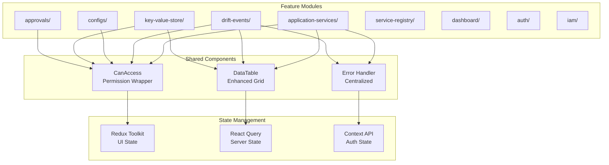
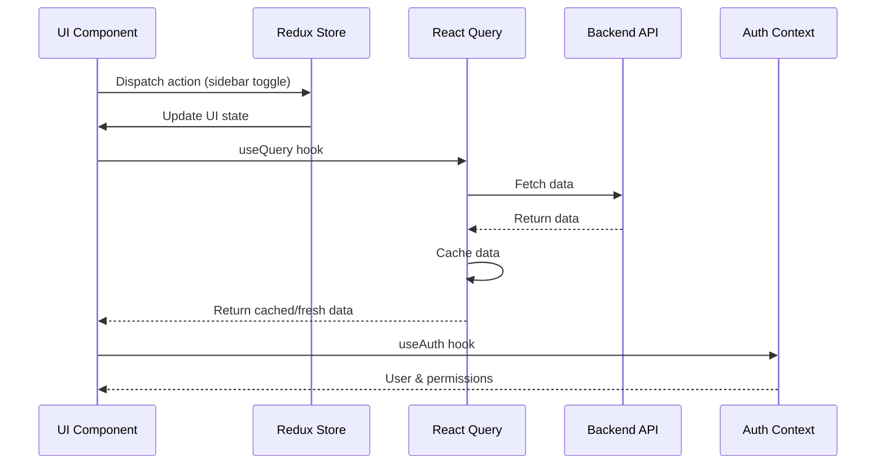

# Admin Dashboard - Technical Details

## Overview

The Admin Dashboard is a React-based web application that provides a comprehensive interface for managing the Centralized Configuration Management system. It implements a permission-based UI architecture with real-time updates and responsive design.

---

## Architecture

### Component Structure



### Feature Module Organization

Each feature module follows a consistent structure:

```
features/
├── {feature-name}/
│   ├── components/      # Feature-specific components
│   ├── pages/          # Page components
│   ├── hooks/          # Custom hooks
│   ├── types.ts        # TypeScript types
│   └── index.ts        # Public exports
```

**Reference:** `admin-dashboard/src/features/`

---

## Permission System

### Declarative Permission Component

The `<CanAccess>` component provides a declarative way to control UI element visibility based on permissions.

**Implementation:** `admin-dashboard/src/components/auth/CanAccess.tsx`

#### Usage Examples

```tsx
// Service-specific permission
<CanAccess permission="edit-service" serviceId="payment-service">
  <Button>Edit Service</Button>
</CanAccess>

// Role-based permission
<CanAccess role="SYS_ADMIN">
  <MenuItem>Admin Panel</MenuItem>
</CanAccess>

// Route access
<CanAccess permission="access-route" route="/admin">
  <NavLink to="/admin">Admin</NavLink>
</CanAccess>

// With fallback
<CanAccess 
  permission="delete-service" 
  serviceId={serviceId}
  fallback={<Tooltip title="No permission"><span><Button disabled>Delete</Button></span></Tooltip>}
>
  <Button color="error">Delete</Button>
</CanAccess>
```

#### Permission Types

- **Route-based**: Control access to entire pages
- **Role-based**: SYS_ADMIN, USER roles
- **Service-based**: Team ownership checks
- **Action-based**: VIEW, EDIT, DELETE, MANAGE_SHARES

### Imperative Permission Hook

The `usePermissions` hook provides imperative permission checking for conditional logic.

**Implementation:** `admin-dashboard/src/features/auth/hooks/usePermissions.ts`

```tsx
const { canEditService, canDeleteService } = usePermissions();

if (canEditService(serviceId)) {
  // Show edit button
}
```

---

## State Management Strategy

### Three-Layer State Architecture

1. **Redux Toolkit** - UI State
   - Sidebar open/closed state
   - Theme mode (light/dark)
   - Global notifications
   - Persisted to localStorage

2. **React Query** - Server State
   - API data caching
   - Automatic refetching
   - Optimistic updates
   - Error handling

3. **Context API** - Authentication
   - Keycloak token management
   - User context
   - Permission cache

**Reference:**
- `admin-dashboard/src/store/uiSlice.ts` - Redux state
- `admin-dashboard/src/features/auth/authContext.tsx` - Auth context

### State Management Flow



---

## API Integration

### Orval Code Generation

The dashboard uses Orval to generate TypeScript types and React Query hooks from the OpenAPI specification.

**Configuration:** `admin-dashboard/orval.config.js`

**Generated Files:**
- `admin-dashboard/src/lib/api/models/` - TypeScript types
- `admin-dashboard/src/lib/api/hooks.ts` - React Query hooks

**Usage:**
```tsx
import { useListApplicationServices, useCreateApplicationService } from '@lib/api/hooks';

const { data, isLoading, error } = useListApplicationServices();
const mutation = useCreateApplicationService();
```

### Error Handling

Centralized error transformation with RFC-7807 support.

**Implementation:** `admin-dashboard/src/lib/api/errorHandler.ts`

**Features:**
- Typed error transformation
- Sonner toast notifications
- Network error handling
- Custom error messages
- Silent error option

**Usage:**
```tsx
import { handleApiError, showSuccess } from '@lib/api/errorHandler';

const mutation = useMutation({
  mutationFn: createService,
  onSuccess: () => {
    showSuccess('Service Created', 'Your service has been created successfully');
  },
  onError: (error) => {
    handleApiError(error);
  }
});
```

---

## Key Features Implementation

### 1. Service Management

**Components:**
- `ApplicationServiceListPage.tsx` - Service catalog
- `ApplicationServiceDetailPage.tsx` - Service details
- `ApplicationServiceForm.tsx` - Create/edit form
- `ClaimOwnershipDialog.tsx` - Ownership claiming

**Features:**
- Filter by ownership (owned, shared, orphaned)
- Search by service name
- Environment management
- Service sharing configuration

**Reference:** `admin-dashboard/src/features/application-services/`

### 2. Drift Event Monitoring

**Components:**
- `DriftEventListPage.tsx` - Event list with filters
- `DriftEventDetailPage.tsx` - Event details
- `DriftEventTable.tsx` - Enhanced data table
- `ResolveDialog.tsx` - Manual resolution

**Features:**
- Filter by severity, status, service
- Bulk resolution actions
- Real-time updates (auto-refresh)
- Drift timeline visualization

**Reference:** `admin-dashboard/src/features/drift-events/`

### 3. Configuration Viewer

**Components:**
- `ConfigListPage.tsx` - Config catalog
- `ConfigDetailPage.tsx` - Config details with Monaco editor
- `PropertySourceViewer.tsx` - Property navigation
- `ConfigStats.tsx` - Configuration statistics

**Features:**
- YAML/JSON syntax highlighting (Monaco Editor)
- Property search and filter
- Configuration comparison
- Property type indicators

**Reference:** `admin-dashboard/src/features/configs/`

### 4. Key-Value Store

**Components:**
- `KVStorePage.tsx` - Main KV interface
- `KVTreeView.tsx` - Tree navigation
- `KVFlatListView.tsx` - Flat list view
- `KVJsonEditor.tsx` - JSON editor with validation
- `KVBulkActions.tsx` - Bulk operations

**Features:**
- Tree and flat list views
- JSON editor with validation
- Prefix-based navigation
- Bulk create/update/delete
- Type detection (string, number, boolean, object, array)

**Reference:** `admin-dashboard/src/features/key-value-store/`

### 5. Approval Workflows

**Components:**
- `ApprovalListPage.tsx` - Request list
- `ApprovalDetailPage.tsx` - Request details
- `ApprovalStepper.tsx` - Multi-gate visualization
- `DecisionTimeline.tsx` - Decision history
- `DecisionDialog.tsx` - Approval/rejection dialog

**Features:**
- Multi-gate approval visualization
- Decision timeline with timestamps
- Approver information display
- Request status tracking

**Reference:** `admin-dashboard/src/features/approvals/`

### 6. Service Registry Integration

**Components:**
- `ServiceRegistryListPage.tsx` - Consul services
- `ServiceRegistryDetailPage.tsx` - Service instances
- `ConsulServiceCard.tsx` - Service card
- `ConsulHealthBadge.tsx` - Health status

**Features:**
- Consul service discovery
- Health check visualization
- Instance details (host, port, tags)
- Auto-refresh (60s interval)

**Reference:** `admin-dashboard/src/features/service-registry/`

---

## Enhanced DataTable Component

The dashboard includes a reusable DataTable component built on MUI DataGrid.

**Implementation:** `admin-dashboard/src/components/common/DataTable.tsx`

### Features

- **Search**: Search across all columns
- **Column Visibility**: Toggle column visibility via menu
- **Export**: Export to CSV
- **Filtering**: Advanced filtering (built-in DataGrid filters)
- **Density**: Compact/standard/comfortable
- **Pagination**: Client-side and server-side support
- **Custom Actions**: Support for row actions

### Usage

```tsx
<DataTable
  rows={services}
  columns={[
    { field: 'id', headerName: 'ID', width: 100 },
    { field: 'name', headerName: 'Service Name', flex: 1 },
    { field: 'owner', headerName: 'Owner', width: 150 },
    { 
      field: 'actions', 
      headerName: 'Actions',
      renderCell: (params) => (
        <Button onClick={() => handleEdit(params.row)}>Edit</Button>
      )
    },
  ]}
  loading={isLoading}
  searchable
  exportable
  exportFilename="services-list"
  getRowId={(row) => row.id}
/>
```

---

## Build & Deployment

### Development

```bash
npm run dev
# Runs on http://localhost:5173
# Proxies /api requests to http://localhost:8081
```

### Production Build

```bash
npm run build
# Output: dist/ directory ready for deployment
```

### API Generation

```bash
npm run generate:api
# Regenerates API hooks from OpenAPI spec
```

### Docker Deployment

The dashboard is containerized with Nginx for production deployment.

**Dockerfile:** `admin-dashboard/Dockerfile`
**Nginx Config:** `admin-dashboard/nginx.conf`

---

## Performance Considerations

### Code Splitting

- Feature-based code splitting
- Lazy loading for routes
- Dynamic imports for heavy components

### Caching Strategy

- React Query cache with stale time configuration
- Redux state persistence to localStorage
- API response caching (30s-60s stale time)

### Bundle Size

- Tree shaking enabled
- Production build optimization
- Monaco Editor loaded on demand

---

## Testing

### Component Testing

- React Testing Library for component tests
- Mock API responses
- Permission testing

### E2E Testing

- Playwright for end-to-end tests
- Test scenarios for critical flows
- Permission-based access tests

**Reference:** `admin-dashboard/tests/`

---

## Future Enhancements

1. **Advanced Analytics**
   - Dashboard charts integration
   - Trend analysis
   - Custom reports

2. **Mobile Responsiveness**
   - Enhanced mobile layouts
   - Touch-optimized interactions

3. **Real-time Updates**
   - WebSocket integration
   - Live drift event notifications

4. **Bulk Operations**
   - Multi-select actions
   - Batch service operations

---

## References

- **Implementation Summary:** `admin-dashboard/IMPLEMENTATION_SUMMARY.md`
- **Component Source:** `admin-dashboard/src/`
- **API Hooks:** `admin-dashboard/src/lib/api/hooks.ts`
- **Permission Component:** `admin-dashboard/src/components/auth/CanAccess.tsx`
- **Error Handler:** `admin-dashboard/src/lib/api/errorHandler.ts`

