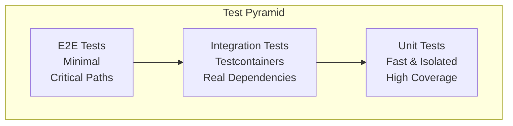

# Testing Strategy
## Centralized Configuration Management System

---

## Overview

The system implements a comprehensive testing strategy following the test pyramid principle: fast unit tests at the base, integration tests in the middle, and minimal end-to-end tests at the top. All tests are automated and integrated into the CI/CD pipeline.

### Test Pyramid



**Test Distribution:**
- **Unit Tests**: 60-70% of test suite
- **Integration Tests**: 25-30% of test suite
- **E2E Tests**: 5-10% of test suite

---

## Test Types

### 1. Unit Tests

**Framework:** JUnit 5, Mockito, AssertJ

**Scope:**
- Domain logic (business rules, validations)
- Service layer (application services, command/query services)
- Utility classes and helpers
- Mappers and converters

**Characteristics:**
- Fast execution (< 1s per test)
- Isolated (no external dependencies)
- High coverage target (80%+)
- Mock external dependencies

**Example Test Structure:**
```java
@ExtendWith(MockitoExtension.class)
class HeartbeatServiceTest {
    @Mock
    private ServiceInstanceRepositoryPort repository;
    
    @InjectMocks
    private HeartbeatService service;
    
    @Test
    void shouldDetectDriftWhenHashesMismatch() {
        // Test implementation
    }
}
```

**Reference:** `config-control-service/src/test/java/`

### 2. Integration Tests

**Framework:** JUnit 5, Testcontainers, Spring Boot Test Slices

**Scope:**
- Repository layer (MongoDB operations)
- External service clients (Config Server, Consul, Keycloak)
- Cache operations (Redis, Caffeine)
- Kafka message processing

**Testcontainers:**
- MongoDB container for database tests
- Redis container for cache tests
- Kafka container for messaging tests
- Ephemeral containers (created per test class)

**Characteristics:**
- Slower execution (5-30s per test)
- Real dependencies (containers)
- Deterministic test data
- Network aliases for stable connections

**Example Test Structure:**
```java
@SpringBootTest
@Testcontainers
class ServiceInstanceRepositoryTest {
    @Container
    static MongoDBContainer mongo = new MongoDBContainer("mongo:8.0");
    
    @Autowired
    private ServiceInstanceRepository repository;
    
    @Test
    void shouldSaveAndRetrieveServiceInstance() {
        // Test implementation
    }
}
```

**Reference:** `config-control-service/src/test/java/`

### 3. End-to-End (E2E) Tests

**Framework:** REST Assured, Allure Reporting, JUnit 5

**Scope:**
- Complete API workflows
- Authentication and authorization flows
- Business process validation
- Cross-service integration

**Test Structure:**
- **Smoke Tests**: Critical happy path scenarios
- **Workflow Tests**: End-to-end business scenarios
- **Regression Tests**: Comprehensive endpoint coverage

**Characteristics:**
- Slowest execution (30s-5min per test)
- Full stack (no mocks)
- Real services and dependencies
- Detailed reporting (Allure)

**Example Test Structure:**
```java
@SpringBootTest(webEnvironment = SpringBootTest.WebEnvironment.RANDOM_PORT)
class Auth2E2Test extends BaseE2ETest {
    @Test
    void shouldAuthenticateAndAuthorizeUser() {
        // E2E test implementation
    }
}
```

**Reference:** `config-control-service/src/e2eTest/`, `config-control-service/test/README.md`

### 4. Smoke Tests

**Framework:** Shell scripts, curl, jq

**Scope:**
- Infrastructure health checks
- Critical endpoint validation
- Security smoke tests
- CRUD operation validation

**Test Scripts:**
- `infra-health-check.sh` - Infrastructure services health
- `security-smoke-test.sh` - Authentication/authorization
- `crud-smoke-test.sh` - Comprehensive CRUD operations
- `validate-critical-endpoints.sh` - Quick endpoint validation

**Characteristics:**
- Fast execution (15s-3min)
- Manual or automated execution
- Pre-deployment validation
- Post-deployment verification

**Reference:** `config-control-service/test/`, `test/README.md`

---

## Test Coverage

### Current Status

- **Overall Coverage**: ~70%
- **Target Coverage**: 80%+
- **Focus Areas**: Domain logic, service layer, critical paths

### Coverage by Layer

| Layer | Coverage | Target | Notes |
|-------|----------|--------|-------|
| **Domain** | 85%+ | 90%+ | High priority |
| **Application** | 75%+ | 85%+ | Business logic |
| **Infrastructure** | 60%+ | 70%+ | Adapters, clients |
| **API** | 70%+ | 75%+ | Controllers, DTOs |

### Coverage Tools

- **Gradle**: JaCoCo plugin for coverage reports
- **CI/CD**: Coverage gates (fail if below threshold)
- **Reports**: HTML reports in `build/reports/jacoco/`

---

## Test Infrastructure

### Testcontainers

**Purpose:** Integration testing with real dependencies

**Containers Used:**
- MongoDB 8.0 (database tests)
- Redis Latest (cache tests)
- Kafka Latest (messaging tests)
- PostgreSQL (if needed for Keycloak tests)

**Configuration:**
- Ephemeral containers (created per test class)
- Reuse containers locally for faster feedback
- Deterministic seeds for test data
- Network aliases for stable connections

**Reference:** `.cursor/rules/080-testing.mdc`

### Test Data Management

**Builders/Factories:**
- Test data builders for domain objects
- Factory methods for common test scenarios
- No shared mutable fixtures
- Realistic datasets for performance-sensitive paths

**Example:**
```java
ServiceInstance instance = ServiceInstance.builder()
    .serviceId("test-service")
    .instanceId("instance-1")
    .configHash("hash123")
    .build();
```

---

## CI/CD Integration

### Gradle Test Tasks

**Unit Tests:**
```bash
./gradlew test
```

**Integration Tests:**
```bash
./gradlew integrationTest
```

**E2E Tests:**
```bash
./gradlew test --tests Auth2E2Test
```

**All Tests:**
```bash
./gradlew build test integrationTest
```

### Test Execution

**Local Development:**
- Fast feedback loop (< 5 minutes for full suite)
- Testcontainers reuse for speed
- Coverage reports generated automatically

**CI/CD Pipeline:**
- All tests run on every commit
- Coverage gates enforced
- Test reports published
- Flaky test retries (with limits)

---

## Key Test Files

### Config Control Service

**Unit/Integration Tests:**
- `src/test/java/` - JUnit 5 tests
- `Auth2E2Test.java` - Authentication E2E test
- `CacheE2ETest.java` - Cache integration test

**E2E Test Framework:**
- `src/e2eTest/java/com/example/control/e2e/` - E2E test framework
- `base/BaseE2ETest.java` - Base class for E2E tests
- `smoke/` - Smoke test suites
- `workflows/` - Workflow test suites
- `regression/` - Regression test suites

**Shell-Based Tests:**
- `test/keycloak/security-smoke-test.sh` - Security validation
- `test/crud-smoke-test.sh` - CRUD operations validation
- `test/README.md` - Test execution guide

### Infrastructure Tests

**Test Scripts:**
- `test/infra-health-check.sh` - Infrastructure health
- `test/network-connectivity-test.sh` - Network validation
- `test/observability-pipeline-test.sh` - LGTM stack validation
- `test/e2e-integration-test.sh` - Full stack E2E test

**Reference:** `test/README.md`, `test/flows/README.md`

---

## Test Validation Checklist

### Functional Testing ✅

- [x] Authentication and authorization
- [x] Service CRUD operations
- [x] Drift detection workflows
- [x] Approval workflows
- [x] Service sharing
- [x] Key-Value store operations

### Non-Functional Testing ✅

- [x] Performance smoke tests
- [x] Security boundary tests
- [x] Resilience tests (circuit breakers, timeouts)
- [x] Rate limiting validation

### Integration Testing ✅

- [x] Database operations (MongoDB)
- [x] Cache operations (Redis)
- [x] Message processing (Kafka)
- [x] External service clients (Config Server, Consul, Keycloak)

---

## Best Practices

1. **Test Isolation**: Each test is independent, no shared state
2. **Deterministic Data**: Use builders/factories for test data
3. **Fast Feedback**: Unit tests run in < 1s, integration tests < 30s
4. **Coverage Gates**: Enforce minimum coverage thresholds
5. **Test Naming**: Descriptive test names explaining what is tested
6. **Arrange-Act-Assert**: Clear test structure
7. **Mock External Dependencies**: Unit tests mock, integration tests use containers

---

## References

- [Test Execution Guide](../../../config-control-service/test/README.md)
- [E2E Testing Framework](../../../config-control-service/src/e2eTest/README.md)
- [Testing Rules](../../../../.cursor/rules/080-testing.mdc)
- [Test Flows Documentation](../../../../test/flows/README.md)

