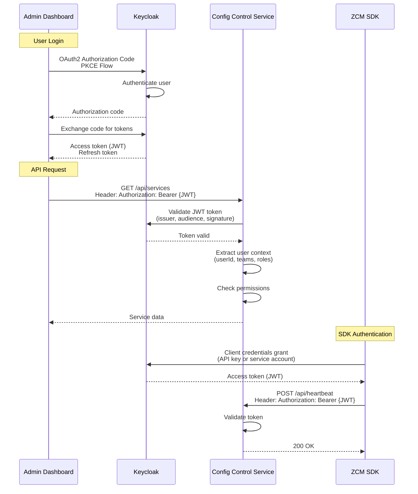
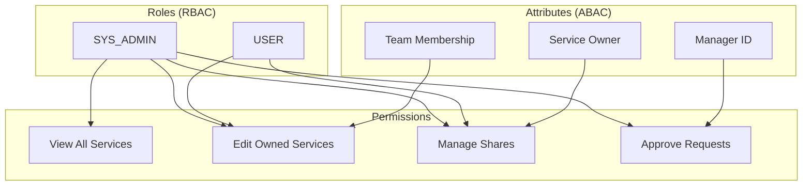
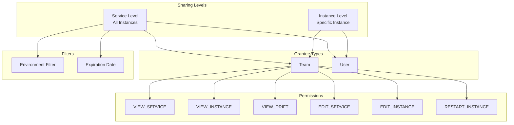
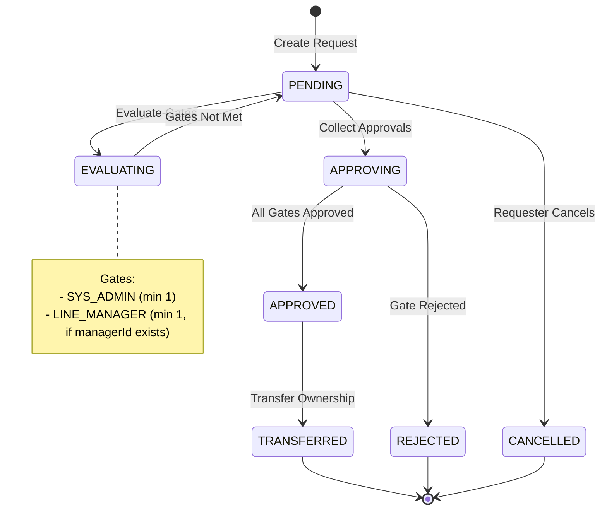

# Security & Compliance
## Centralized Configuration Management System

**Presentation Time:** 5-7 minutes  
**Target Audience:** Manager, Tech Lead, Head of Department

---

## Security Overview

The system implements comprehensive security controls with OAuth2/OIDC authentication, fine-grained authorization, and full audit trails for compliance.

---

## Authentication Flow

### OAuth2/OIDC Integration



### Keycloak Configuration

**Realm:** `config-control-realm`

**Clients:**
- `admin-dashboard` - Public client (PKCE)
- `config-control-service` - Confidential client
- `zcm-sdk` - Service account client

**User Attributes:**
- `groups` → Team IDs
- `realm_access.roles` → System roles (SYS_ADMIN, USER)
- `manager_id` → Line manager ID (for approval workflows)

**Reference:** `config-control-service/README-KEYCLOAK.md`

---

## Authorization Model

### RBAC + ABAC Hybrid



### Access Control Rules

| Resource | Owner Team | Shared Team | Orphan | SYS_ADMIN |
|----------|-----------|-------------|--------|-----------|
| **View Service** | ✅ | ✅ (if shared) | ✅ | ✅ |
| **Edit Service** | ✅ | ❌ | ❌ | ✅ |
| **Delete Service** | ✅ | ❌ | ❌ | ✅ |
| **Manage Shares** | ✅ | ❌ | ❌ | ✅ |
| **View Instances** | ✅ | ✅ (if shared) | ✅ | ✅ |
| **Edit Instances** | ✅ | ✅ (if shared) | ❌ | ✅ |
| **View Drift** | ✅ | ✅ (if shared) | ✅ | ✅ |
| **Approve Requests** | ❌ | ❌ | ❌ | ✅ (or LINE_MANAGER) |

### Permission Evaluation

**Implementation:** `config-control-service/src/main/java/com/example/control/infrastructure/config/security/DomainPermissionEvaluator.java`

**Method Security:**
```java
@PreAuthorize("hasPermission(#serviceId, 'ApplicationService', 'EDIT_SERVICE')")
public void updateService(String serviceId, UpdateRequest request) {
    // ...
}
```

---

## Service Sharing Model

### Fine-Grained Sharing



**Implementation:** `config-control-service/src/main/java/com/example/control/domain/model/ServiceShare.java`

**Permissions:**
- `VIEW_SERVICE` - View service metadata
- `VIEW_INSTANCE` - View service instances
- `VIEW_DRIFT` - View drift events
- `EDIT_SERVICE` - Edit service metadata
- `EDIT_INSTANCE` - Edit instance configuration
- `RESTART_INSTANCE` - Trigger instance restart

---

## Approval Workflow

### Multi-Gate Approval



### Approval Gates

1. **SYS_ADMIN Gate** (Required)
   - Minimum approvals: 1
   - Approvers: Users with SYS_ADMIN role

2. **LINE_MANAGER Gate** (Conditional)
   - Minimum approvals: 1 (if requester has managerId)
   - Approvers: Requester's line manager

### Optimistic Locking

**Purpose:** Prevent race conditions during concurrent approvals

**Implementation:** `version` field in `ApprovalRequest`

**Reference:** `config-control-service/src/main/java/com/example/control/domain/model/ApprovalRequest.java:100-101`

---

## Audit & Compliance

### Audit Fields

All domain entities include audit fields:
- `createdBy` - User ID who created the record
- `updatedBy` - User ID who last updated the record
- `createdAt` - Timestamp of creation
- `updatedAt` - Timestamp of last update

**Source:** Extracted from `SecurityContext` (JWT token)

**Implementation:** `config-control-service/src/main/java/com/example/control/infrastructure/config/persistence/MongoAuditingConfig.java`

### Audit Trail

**Tracked Operations:**
- Service creation, update, deletion
- Instance state changes
- Drift event creation and resolution
- Approval request creation and decisions
- Service share creation and revocation

**Compliance Features:**
- Full audit trail for all operations
- User attribution for all changes
- Timestamp tracking
- Approval workflow history

---

## Security Best Practices

### 1. JWT Token Validation

- **Issuer validation**: Verify token issued by Keycloak
- **Audience validation**: Verify token audience matches service
- **Signature verification**: Verify token signature
- **Expiration check**: Reject expired tokens

**Implementation:** `config-control-service/src/main/java/com/example/control/infrastructure/config/security/SecurityConfig.java`

### 2. Input Validation

- **Jakarta Validation**: `@NotNull`, `@NotBlank`, `@Size` annotations
- **DTO validation**: Validate all input DTOs
- **SQL injection prevention**: Use parameterized queries (MongoDB)
- **XSS prevention**: Sanitize user input

### 3. Rate Limiting

- **Heartbeat endpoint**: 50 requests/10s per IP
- **Admin endpoints**: 100 requests/10s per IP
- **Protection**: Prevents abuse and DDoS

**Configuration:** `application-resilience.yml:174-188`

### 4. Secure Communication

- **HTTPS**: All external communication over TLS
- **JWT tokens**: Secure token transmission
- **API keys**: Secure storage for SDK authentication

### 5. Principle of Least Privilege

- **Role-based access**: Users have minimum required permissions
- **Service sharing**: Fine-grained permissions
- **Admin operations**: Restricted to SYS_ADMIN

---

## Security Metrics

| Metric | Value | Purpose |
|--------|-------|---------|
| **JWT Validation Rate** | 100% | All requests validated |
| **Rate Limit Rejections** | < 0.1% | Abuse prevention |
| **Failed Authentication** | < 1% | Security monitoring |
| **Permission Denials** | Tracked | Access control monitoring |

---

## Compliance Features

### 1. Audit Trail
- ✅ Full audit logging for all operations
- ✅ User attribution for all changes
- ✅ Timestamp tracking

### 2. Access Control
- ✅ Role-based access control (RBAC)
- ✅ Attribute-based access control (ABAC)
- ✅ Fine-grained permissions

### 3. Approval Workflows
- ✅ Multi-gate approval for ownership transfers
- ✅ Approval history tracking
- ✅ Optimistic locking for consistency

### 4. Data Protection
- ✅ Secure token storage
- ✅ Encrypted communication (TLS)
- ✅ Secure API key management

---

## Appendices

For detailed information, see:
- [Authentication Implementation](./appendices/authentication.md)
- [Authorization Model](./appendices/authorization.md)
- [Audit Logging](./appendices/audit-logging.md)

---

**Next:** Review [Performance & Scalability](../05-performance-scalability/README.md) for performance metrics.

