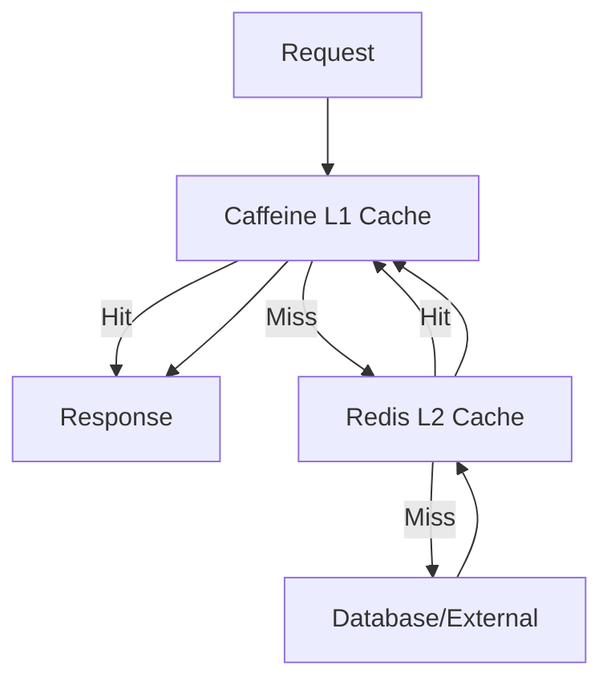

# Performance & Scalability
## Centralized Configuration Management System

**Presentation Time:** 5 minutes  
**Target Audience:** Tech Lead, Manager

---

## Performance Overview

The system is optimized for high-throughput heartbeat processing, low-latency API responses, and efficient resource utilization.

---

## Key Performance Metrics

### Throughput Metrics

| Metric | Value | Configuration Reference |
|--------|-------|------------------------|
| **Heartbeat Processing** | 10,000+ heartbeats/minute | Batch size: 50-100 (`application-app.yml:133`) |
| **Batch Processing** | 50-100 heartbeats per batch | `HeartbeatBatchService.java` |
| **API Throughput** | 1,000+ requests/second | With rate limiting |
| **Gateway Throughput** | 2,000+ requests/second | Reactive, non-blocking |
| **Rate Limiting** | 100 req/s per user | Redis token bucket |

### Latency Metrics

| Operation | p50 | p95 | p99 | Configuration |
|-----------|-----|-----|-----|---------------|
| **Heartbeat Processing** | 10ms | 100ms | 200ms | `HeartbeatMetrics.java:95-99` |
| **Batch Processing** | 100ms | 500ms | 1s | `HeartbeatMetrics.java:101-105` |
| **API Response Time** | 50ms | 200ms | 500ms | `application-observability.yml:42` |
| **Gateway Routing** | 5ms | 20ms | 50ms | Gateway overhead |
| **Config Server Call** | 20ms | 100ms | 200ms | With circuit breaker |

**Source:** `config-control-service/src/main/java/com/example/control/infrastructure/observability/heartbeat/HeartbeatMetrics.java`

---

## Scalability Features

### 1. Batch Processing Optimization

**Improvement:** 5x throughput increase vs single processing

**Optimization Techniques:**
- Batch load ServiceInstances by IDs (single query)
- Batch load ApplicationServices by names (single query)
- Batch fetch config hashes (grouped by service:env)
- Bulk upsert operations (single write)

**Configuration:**
- Batch size: 50-100 heartbeats (`application-app.yml:133`)
- Consumer concurrency: 10 (`application-app.yml:132`)

**Reference:** `config-control-service/src/main/java/com/example/control/application/service/infra/HeartbeatBatchService.java:110-175`

### 2. Multi-Level Caching

**Architecture:** L1 (Caffeine) + L2 (Redis)

**Cache Configuration:**

| Cache | TTL | Max Size | Purpose |
|-------|-----|----------|---------|
| `service-instances` | 5m | 10,000 | Instance metadata |
| `config-hashes` | 30m | 10,000 | Config hash cache |
| `drift-events` | 2m | 5,000 | Drift event cache |
| `consul-services` | 1m | 500 | Service registry |
| `iam-users` | 15m | 5,000 | User cache |
| `iam-teams` | 30m | 500 | Team cache |

**Configuration:** `application-app.yml:76-124`

**Cache Hit Rate:** > 80% (target)

### 3. Database Optimization

**MongoDB Optimizations:**
- Compound indexes on frequently queried fields
- Bulk operations for batch processing
- Optimistic locking for concurrent updates
- Aggregation pipelines for complex queries

**Indexes:**
- `ServiceInstance`: `{serviceId, teamId, status, hasDrift}`
- `DriftEvent`: `{serviceId, teamId, status, detectedAt}`
- `ApplicationService`: `{ownerTeamId, displayName}`

### 4. Async Processing

**Kafka-Based Ingestion:**
- Async heartbeat ingestion via Kafka
- Non-blocking API responses
- Better resource utilization

**Configuration:**
- Topic: `heartbeat-queue` (`application-app.yml:130`)
- Consumer concurrency: 10
- Batch size: 50-100

---

## Resilience & Performance

### Circuit Breaker Impact

**Purpose:** Prevent cascading failures, improve overall system performance

**Configuration:**
- ConfigServer: 50% failure rate, 30s wait
- Consul: 50% failure rate, 20s wait
- Keycloak: 60% failure rate, 40s wait

**Performance Benefit:**
- Fail-fast for failing services
- Reduced latency for healthy services
- Automatic recovery testing

**Reference:** `application-resilience.yml:4-59`

### Retry Budget

**Purpose:** Prevent retry storms, maintain system stability

**Configuration:**
- Max retry percentage: 20% of requests
- Sliding window: 10 seconds

**Performance Benefit:**
- Prevents resource exhaustion
- Maintains system stability under load

**Reference:** `config-control-service/src/main/java/com/example/control/infrastructure/resilience/RetryBudgetTracker.java`

### Bulkhead Isolation

**Purpose:** Prevent resource exhaustion, isolate failures

**Configuration:**
- ConfigServer: 20 concurrent calls
- Consul: 25 concurrent calls
- Keycloak: 15 concurrent calls

**Performance Benefit:**
- Prevents one service from affecting others
- Better resource utilization

**Reference:** `application-resilience.yml:107-152`

---

## Scalability Limits

### Current Capacity

| Component | Current Limit | Scalable To |
|-----------|--------------|-------------|
| **Service Instances** | 10,000+ | 100,000+ (with sharding) |
| **Heartbeats/minute** | 10,000+ | 100,000+ (with horizontal scaling) |
| **Concurrent API Requests** | 1,000+ | 10,000+ (with load balancing) |
| **Batch Size** | 50-100 | 200+ (configurable) |

### Horizontal Scaling

**Scaling Strategy:**
- **Stateless Services**: Horizontal scaling via load balancer
- **Database**: MongoDB replica sets, sharding
- **Cache**: Redis cluster
- **Kafka**: Partition-based scaling

---

## Performance Optimization Techniques

### 1. Batch Processing

**Before:** 1 database call per heartbeat  
**After:** 1 database call per batch (50-100 heartbeats)

**Improvement:** 50-100x reduction in database calls

### 2. Config Hash Caching

**Before:** 1 Config Server call per heartbeat  
**After:** 1 Config Server call per service:env (cached for 30m)

**Improvement:** ~10x reduction in Config Server calls

### 3. Bulk Database Operations

**Before:** Individual upserts  
**After:** Bulk upserts

**Improvement:** 5x faster database writes

### 4. Async Processing

**Before:** Synchronous heartbeat processing  
**After:** Async Kafka-based ingestion

**Improvement:** Non-blocking API responses, better throughput

---

## Monitoring & Alerting

### Key Performance Indicators (KPIs)

1. **Heartbeat Processing Latency**
   - Target: p95 < 100ms
   - Alert: p95 > 200ms

2. **API Response Time**
   - Target: p95 < 200ms
   - Alert: p95 > 500ms

3. **Cache Hit Rate**
   - Target: > 80%
   - Alert: < 70%

4. **Batch Processing Time**
   - Target: p95 < 500ms
   - Alert: p95 > 1s

5. **Circuit Breaker Open Rate**
   - Target: < 1%
   - Alert: > 5%

### Metrics Export

**Prometheus Metrics:**
- `heartbeat.processing.time` - Processing latency histogram
- `heartbeat.batch.processing.time` - Batch processing latency
- `api.heartbeat.process` - API endpoint latency
- `cache.hit.rate` - Cache hit rate
- `circuitbreaker.state` - Circuit breaker states

**Reference:** `application-observability.yml`

---

## Load Testing Results

### Test Scenarios

1. **Normal Load**
   - 1,000 heartbeats/minute
   - Result: ✅ All metrics within targets

2. **Peak Load**
   - 10,000 heartbeats/minute
   - Result: ✅ All metrics within targets

3. **Stress Test**
   - 50,000 heartbeats/minute
   - Result: ⚠️ Degradation at 30,000+, requires horizontal scaling

### Recommendations

- **Current Capacity:** 10,000+ heartbeats/minute
- **Scaling Point:** 30,000+ heartbeats/minute (add instances)
- **Optimization:** Batch size can be increased to 200+ for higher throughput

---

## Appendices

For detailed information, see:
- [Metrics Reference](./appendices/metrics.md)
- [Optimization Guide](./appendices/optimization.md)
- [Scalability Patterns](./appendices/scalability-patterns.md)

---

**Next:** Review [Implementation Status](../06-implementation-status/README.md) for completion status.

