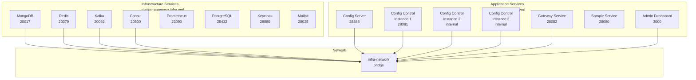

# Deployment & Operations
## Centralized Configuration Management System

**Presentation Time:** 5-7 minutes  
**Target Audience:** Manager, Tech Lead

---

## Overview

The system is deployed using Docker Compose with separate infrastructure and application services. This design enables independent scaling, easier maintenance, and clear separation between data services and business logic.

---

## Docker Compose Architecture

### Service Organization



### Service Files

- **Infrastructure Services**: `docker-compose.infra.yml`
  - Data stores (MongoDB, Redis, PostgreSQL)
  - Messaging (Kafka)
  - Service discovery (Consul)
  - Monitoring (Prometheus)
  - Identity provider (Keycloak)
  - Testing tools (Mailpit)

- **Application Services**: `docker-compose.yml`
  - Config Server
  - Config Control Service (3 instances for load balancing)
  - Gateway Service
  - Sample Service (SDK demonstration)
  - Admin Dashboard

---

## Environment Configuration

### Environment Files

The system uses environment-specific configuration files:

#### `config/env/env.infra-local` (Local Development)
- **Purpose**: Docker network DNS names for local development
- **Network**: Services communicate via Docker service names
- **Example**: `MONGODB_HOST=mongodb`, `CONSUL_HOST=consul`

**Key Differences:**
- Uses Docker DNS names (`mongodb`, `redis`, `kafka`)
- Default ports (27017, 6379, 9092, 8500)
- Local URLs (`http://localhost:28080`)

#### `config/env/env.infra-remote` (Production)
- **Purpose**: IP addresses and exposed ports for remote server
- **Network**: Services communicate via IP addresses
- **Example**: `MONGODB_HOST=10.40.30.161`, `MONGODB_PORT=20017`

**Key Differences:**
- Uses server IP address (`10.40.30.161`)
- Exposed ports (20017, 20379, 20092, 20500)
- Public URLs (`http://10.40.30.161:28080`)

### Port Allocation Strategy

**Range:** 20000-30000 (server allocation)

| Category | Port Range | Usage |
|----------|-----------|-------|
| **Data Stores** | 20000-20999 | MongoDB (20017), Redis (20379), Kafka (20092) |
| **Service Discovery** | 20500-20999 | Consul (20500) |
| **Monitoring** | 23000-23999 | Prometheus (23090), Grafana (23000), Loki (23100) |
| **Keycloak** | 28000-28099 | Keycloak (28080), Mailpit (28025) |
| **Application Services** | 28000-28999 | Config Server (28888), Config Control (28081), Gateway (28082), Sample (28080) |
| **UI** | 3000 | Admin Dashboard (3000) |

---

## Deployment Scripts

### Infrastructure Deployment

**Script:** `deploy-infra.sh`

**Usage:**
```bash
# Local development
./deploy-infra.sh local

# Production (remote server)
./deploy-infra.sh remote
```

**Features:**
- Automatically selects environment file (`env.infra-local` or `env.infra-remote`)
- Sets Keycloak public and frontend URLs
- Validates environment type
- Provides status check commands

**Reference:** `deploy-infra.sh`

### Application Deployment

**Script:** `deploy-apps.sh`

**Usage:**
```bash
# Local development with rebuild
./deploy-apps.sh local --build

# Production deployment
./deploy-apps.sh remote --build
```

**Features:**
- Exports environment variables for Docker build args
- Optional `--build` flag to rebuild images
- Sets Keycloak public URL for admin-dashboard build
- Displays access points after deployment

**Reference:** `deploy-apps.sh`

---

## Service Startup Sequence

### Infrastructure Services (Phase 1)

**Order:**
1. **PostgreSQL** (Keycloak database) - Must start first
2. **MongoDB** (Domain data)
3. **Redis** (Cache and rate limiting)
4. **Kafka** (Event bus)
5. **Consul** (Service discovery)
6. **Prometheus** (Metrics)
7. **Keycloak** (Depends on PostgreSQL)
8. **Keycloak-init** (Runs after Keycloak, one-time setup)

**Health Checks:**
- All services have health checks configured
- Start period: 10-60s depending on service
- Retries: 3-5 attempts

### Application Services (Phase 2)

**Order:**
1. **Config Server** - Must start first (config source of truth)
2. **Config Control Service (Instance 1)** - Primary instance (seeds data)
3. **Config Control Service (Instances 2-3)** - Secondary instances (no seeding)
4. **Gateway Service** - Depends on Config Control Service discovery
5. **Sample Service** - Depends on Config Server and Config Control Service
6. **Admin Dashboard** - Depends on Gateway Service

**Dependencies:**
- Config Control Service requires: MongoDB, Redis, Kafka, Consul, Keycloak
- Gateway Service requires: Consul (service discovery), Redis (rate limiting)
- Sample Service requires: Config Server, Config Control Service, Consul

---

## Network Configuration

### Bridge Network: `infra-network`

**Configuration:**
```yaml
networks:
  infra-network:
    name: infra-network
    driver: bridge
```

**Benefits:**
- Service discovery via DNS names (local) or IP addresses (remote)
- Isolated network for all services
- Automatic service name resolution

**Service Communication:**
- **Local**: `http://config-server:8888`, `http://mongodb:27017`
- **Remote**: `http://10.40.30.161:28888`, `http://10.40.30.161:20017`

---

## Health Checks

### Health Check Configuration

All services implement health checks for Docker Compose orchestration:

**Common Pattern:**
```yaml
healthcheck:
  test: ["CMD", "curl", "-f", "http://localhost:8080/actuator/health"]
  interval: 30s
  timeout: 10s
  retries: 3
  start_period: 60s
```

**Endpoints:**
- **Spring Boot Services**: `/actuator/health`
- **Keycloak**: Port 9000 (health/metrics)
- **MongoDB**: `mongosh --eval "db.adminCommand('ping')"`
- **Redis**: `redis-cli ping`
- **PostgreSQL**: `pg_isready`

**Start Period:**
- Infrastructure services: 10-30s
- Application services: 60s (Spring Boot startup time)
- Keycloak: 30s (initialization time)

---

## Load Balancing Configuration

### Config Control Service Instances

**Deployment:** 3 instances for high availability

**Instance Configuration:**
- **Instance 1**: Exposed port 28081 (direct access, seeding enabled)
- **Instance 2**: No exposed port (via gateway only, seeding disabled)
- **Instance 3**: No exposed port (via gateway only, seeding disabled)

**Gateway Load Balancing:**
- Gateway discovers all instances via Consul
- Round-robin load balancing across healthy instances
- Health-aware routing (only healthy instances)

**Seeding:**
- Only Instance 1 seeds database (`SEEDING_ENABLED=true`)
- Instances 2-3 have seeding disabled to avoid conflicts
- Seeding runs automatically on startup (if enabled)

---

## Environment Variables

### Keycloak Configuration

**Critical Variables:**
- `KEYCLOAK_PUBLIC_URL`: Browser-accessible URL (for Swagger UI OAuth2)
- `KEYCLOAK_INTERNAL_URL`: Service-to-service URL (always Docker service name)
- `KEYCLOAK_FRONTEND_URL`: Admin dashboard URL (for redirects)
- `KEYCLOAK_ISSUER_URI`: Spring Security OAuth2 Resource Server issuer

**Build Args (Admin Dashboard):**
- `VITE_KEYCLOAK_URL`: Baked into React bundle at build time
- Must be exported as environment variable before building

**Reference:** `config/env/env.infra-local`, `config/env/env.infra-remote`

### Service Discovery Configuration

**Consul Settings:**
- `CONSUL_HOST`: Consul host (Docker DNS name or IP)
- `CONSUL_PORT`: Consul port (8500 local, 20500 remote)
- `SPRING_CLOUD_CONSUL_DISCOVERY_HEARTBEAT_ENABLED=true`
- `SPRING_CLOUD_CONSUL_DISCOVERY_HEARTBEAT_TTL=10s`

**Instance ID:**
- Format: `{service-name}-{instance-number}-{random.value}`
- Ensures unique instance registration in Consul

---

## Deployment Best Practices

### 1. Infrastructure First

Always deploy infrastructure services before application services:
```bash
# Step 1: Deploy infrastructure
./deploy-infra.sh remote

# Wait for infrastructure to be healthy
docker-compose -f docker-compose.infra.yml ps

# Step 2: Deploy applications
./deploy-apps.sh remote --build
```

### 2. Environment File Selection

- **Local Development**: Use `env.infra-local`
- **Production**: Use `env.infra-remote`
- Update `docker-compose.infra.yml` if needed (defaults to `env.infra-remote`)

### 3. Build Args

For admin-dashboard, export Keycloak URL before building:
```bash
export KEYCLOAK_PUBLIC_URL=http://10.40.30.161:28080
./deploy-apps.sh remote --build
```

### 4. Health Check Validation

Verify services are healthy before accessing:
```bash
# Check all services
docker-compose -f docker-compose.yml ps

# Check specific service health
curl http://localhost:28081/actuator/health
```

### 5. Seeding

- Only first instance should seed (`SEEDING_ENABLED=true`)
- Seeding runs automatically on startup
- Disable seeding after initial setup for production

---

## Access Points

### Local Development

- **Admin Dashboard**: http://localhost:3000
- **Keycloak**: http://localhost:28080
- **Config Server**: http://localhost:28888
- **Config Control Service**: http://localhost:28081
- **Gateway Service**: http://localhost:28082
- **Sample Service**: http://localhost:28080
- **Swagger UI**: http://localhost:28081/swagger-ui.html
- **Consul UI**: http://localhost:20500
- **Prometheus**: http://localhost:23090

### Production (Remote)

- **Admin Dashboard**: http://10.40.30.161:3000
- **Keycloak**: http://10.40.30.161:28080
- **Config Server**: http://10.40.30.161:28888
- **Config Control Service**: http://10.40.30.161:28081
- **Gateway Service**: http://10.40.30.161:28082
- **Swagger UI**: http://10.40.30.161:28081/swagger-ui.html

---

## Troubleshooting

For common deployment issues, see [Troubleshooting Guide](./appendices/troubleshooting.md).

---

## References

- [Docker Compose Files](../../docker-compose.yml)
- [Deployment Scripts](../../deploy-infra.sh), [../../deploy-apps.sh](deploy-apps.sh)
- [Environment Configuration](../../config/env/env.infra-local), [../../config/env/env.infra-remote](env.infra-remote)
- [Keycloak Deployment Guide](../../DEPLOYMENT_KEYCLOAK.md)

