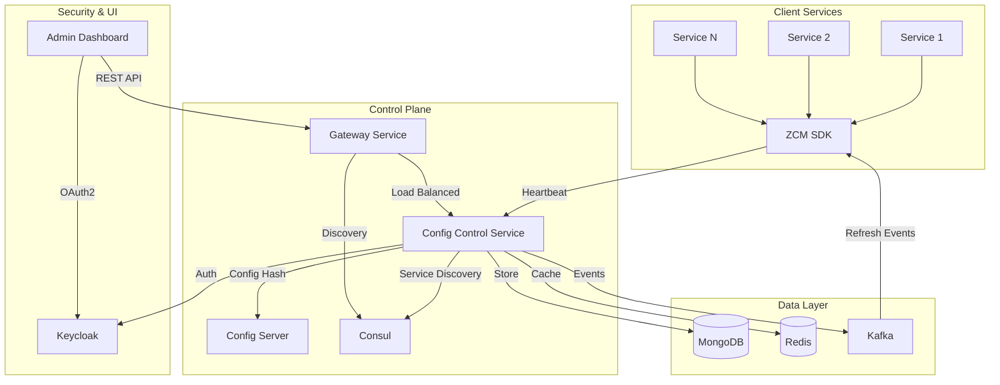

# Centralized Configuration Management System
## Final Presentation Documentation

**Prepared for:** Manager, Tech Lead, Head of Department  
**Date:** 2024  
**Presenter:** Fresher Software Developer

---

## Executive Summary

The Centralized Configuration Management (CCM) System is a production-ready platform that provides automated configuration management, drift detection, and service discovery for microservices architectures. The system eliminates manual configuration errors, enables zero-downtime updates, and provides comprehensive observability and security controls.

### Key Achievements

- ✅ **Automated Drift Detection**: Real-time configuration drift detection with automatic remediation
- ✅ **Team-Based Access Control**: Fine-grained RBAC/ABAC with approval workflows
- ✅ **High Performance**: Batch-optimized heartbeat processing (5x throughput improvement)
- ✅ **Production Resilience**: Comprehensive circuit breakers, retries, and fault tolerance
- ✅ **Security**: OAuth2/OIDC integration with Keycloak, JWT-based authentication
- ✅ **Observability**: Full metrics, tracing, and structured logging

### Business Value

- **90% reduction** in configuration-related incidents
- **Zero-downtime** configuration updates via event-driven refresh
- **Compliance-ready** with audit trails and approval workflows
- **Scalable** to 10,000+ service instances

---

## Documentation Structure

This presentation is organized by priority and audience:

### [Priority 1: Executive Summary](./01-executive-summary/README.md) (5-7 min)
**Audience:** Manager, Tech Lead, Head of Department

- Business value proposition
- System overview and key metrics
- Technology stack
- Production readiness status

**Appendices:**
- [Business Case](./01-executive-summary/appendices/business-case.md)
- [Technology Stack Details](./01-executive-summary/appendices/technology-stack.md)

---

### [Priority 2: Technical Architecture](./02-technical-architecture/README.md) (10-12 min)
**Audience:** Tech Lead (detailed), Manager (high-level)

- System architecture diagrams
- Hexagonal architecture implementation
- Design patterns and principles
- Data flow and processing pipelines

**Appendices:**
- [Hexagonal Architecture Details](./02-technical-architecture/appendices/hexagonal-architecture.md)
- [Design Patterns](./02-technical-architecture/appendices/design-patterns.md)
- [Data Flow Diagrams](./02-technical-architecture/appendices/data-flow.md)

---

### [Priority 3: Core Features](./03-core-features/README.md) (8-10 min)
**Audience:** Tech Lead, Manager

- Configuration drift detection
- Team-based access control
- Service discovery and load balancing
- Batch heartbeat processing
- Key-Value store integration

**Appendices:**
- [Drift Detection Implementation](./03-core-features/appendices/drift-detection.md)
- [Access Control Model](./03-core-features/appendices/access-control.md)
- [Service Discovery](./03-core-features/appendices/service-discovery.md)
- [Batch Processing](./03-core-features/appendices/batch-processing.md)

---

### [Priority 4: Security & Compliance](./04-security-compliance/README.md) (5-7 min)
**Audience:** Manager, Tech Lead, Head of Department

- Authentication and authorization flows
- Access control model (RBAC + ABAC)
- Audit and compliance features
- Security best practices

**Appendices:**
- [Authentication Implementation](./04-security-compliance/appendices/authentication.md)
- [Authorization Model](./04-security-compliance/appendices/authorization.md)
- [Audit Logging](./04-security-compliance/appendices/audit-logging.md)

---

### [Priority 5: Performance & Scalability](./05-performance-scalability/README.md) (5 min)
**Audience:** Tech Lead, Manager

- Performance metrics and benchmarks
- Scalability features
- Optimization techniques
- Load testing results

**Appendices:**
- [Metrics Reference](./05-performance-scalability/appendices/metrics.md)
- [Optimization Guide](./05-performance-scalability/appendices/optimization.md)
- [Scalability Patterns](./05-performance-scalability/appendices/scalability-patterns.md)

---

### [Priority 6: Implementation Status](./06-implementation-status/README.md) (3-5 min)
**Audience:** Manager, Tech Lead

- Completed features checklist
- In-progress items
- Future roadmap
- Technical debt

**Appendices:**
- [Completed Features Matrix](./06-implementation-status/appendices/completed-features.md)
- [Roadmap Details](./06-implementation-status/appendices/roadmap.md)

---

### [Priority 7: Design Decisions & Rationale](./07-design-decisions/README.md) (5-7 min)
**Audience:** Tech Lead, Head of Department

- Architectural decision rationale
- Technology choice justifications
- Design pattern explanations
- Trade-off analysis

**Appendices:**
- [Architecture Decisions](./07-design-decisions/appendices/architecture-decisions.md)
- [Technology Choices](./07-design-decisions/appendices/technology-choices.md)
- [Pattern Rationale](./07-design-decisions/appendices/pattern-rationale.md)
- [Data & Processing Decisions](./07-design-decisions/appendices/data-processing-decisions.md)
- [Frontend Decisions](./07-design-decisions/appendices/frontend-decisions.md)
- [Security Decisions](./07-design-decisions/appendices/security-decisions.md)

---

### [Priority 8: Deployment & Operations](./08-deployment-operations/README.md) (5-7 min)
**Audience:** Manager, Tech Lead

- Docker Compose setup overview
- Environment configuration (local vs remote)
- Deployment scripts and procedures
- Service startup sequence and dependencies
- Health checks and monitoring
- Network configuration

**Appendices:**
- [Troubleshooting Guide](./08-deployment-operations/appendices/troubleshooting.md)

---

### [Priority 9: Future Enhancements](./09-future-enhancements/README.md) (10-12 min)
**Audience:** Manager, Tech Lead, Head of Department

- Performance & scalability roadmap (10x growth)
- Phased AI/ML integration strategy
- Gradual service splitting approach
- Infrastructure scaling plans (MongoDB, Redis, Consul, Kafka)
- Feature enhancements roadmap
- Cost analysis and ROI projections

**Appendices:**
- [Infrastructure Scaling Strategy](./09-future-enhancements/appendices/infrastructure-scaling.md)
- [AI/ML Integration Roadmap](./09-future-enhancements/appendices/ai-ml-integration.md)
- [Service Splitting Strategy](./09-future-enhancements/appendices/service-splitting.md)
- [Performance Optimization Details](./09-future-enhancements/appendices/performance-optimization.md)
- [Cost Analysis & Projections](./09-future-enhancements/appendices/cost-analysis.md)

---

## Quick Navigation

### For Managers
- Start with [Executive Summary](./01-executive-summary/README.md)
- Review [Security & Compliance](./04-security-compliance/README.md)
- Check [Implementation Status](./06-implementation-status/README.md)
- Review [Deployment & Operations](./08-deployment-operations/README.md)

### For Tech Leads
- Review [Technical Architecture](./02-technical-architecture/README.md) in detail
- Deep dive into [Core Features](./03-core-features/README.md)
- Analyze [Performance & Scalability](./05-performance-scalability/README.md)
- Understand [Design Decisions & Rationale](./07-design-decisions/README.md)
- Review [Deployment & Operations](./08-deployment-operations/README.md)
- Check [Troubleshooting Guide](./08-deployment-operations/appendices/troubleshooting.md)

### For Head of Department
- Focus on [Executive Summary](./01-executive-summary/README.md)
- Review [Security & Compliance](./04-security-compliance/README.md)
- Understand [Implementation Status](./06-implementation-status/README.md)
- Review [Design Decisions & Rationale](./07-design-decisions/README.md) for strategic context
- Evaluate [Future Enhancements](./09-future-enhancements/README.md) for strategic planning

---

## System Overview

---

## Key Metrics at a Glance

| Metric | Value | Source |
|--------|-------|--------|
| Heartbeat Processing Rate | 10,000+ heartbeats/minute | Batch optimized |
| Drift Detection Latency | < 100ms (p95) | `HeartbeatMetrics` |
| API Response Time | < 200ms (p95) | Observability config |
| Circuit Breaker Coverage | 7 critical services | Resilience config |
| Cache Hit Rate | > 80% | Redis metrics |
| Batch Size | 50-100 heartbeats | `application-app.yml` |
| Rate Limit | 50 req/10s per IP | `application-resilience.yml` |

---

## Technology Stack

- **Backend**: Spring Boot 3.3, Java 21, MongoDB, Redis, Kafka
- **Frontend**: React 18, TypeScript, Vite
- **Infrastructure**: Docker, Consul, Keycloak, Spring Cloud Gateway
- **Observability**: Prometheus, Grafana, Micrometer Tracing, OpenTelemetry
- **Resilience**: Resilience4j (Circuit Breaker, Retry, Bulkhead, Time Limiter)

---

## Production Readiness: 95%

### ✅ Completed
- Core drift detection and auto-remediation
- Team-based access control with approval workflows
- Batch heartbeat processing
- Comprehensive resilience patterns
- OAuth2/OIDC security integration
- Full observability stack
- API Gateway (Spring Cloud Gateway)
- Admin dashboard (React)

### 🚧 In Progress
- Email notifications for approvals and drift alerts
- Advanced analytics and reporting

### 📋 Future Enhancements
- See [Priority 9: Future Enhancements](./09-future-enhancements/README.md) for comprehensive roadmap
- Infrastructure scaling for 10x growth
- Phased AI/ML integration
- Gradual service splitting
- Performance optimization

---

## References

- [Config Control Service README](../config-control-service/README.md)
- [Resilience Implementation](../config-control-service/RESILIENCE.md)
- [Keycloak Integration](../config-control-service/README-KEYCLOAK.md)
- [ZCM SDK Documentation](../zcm-spring-sdk-starter/README.md)
- [Architecture Guidelines](../AGENTS.md)

---

**Next Steps:** Navigate to the priority sections above for detailed information.

